Article : https://arxiv.org/pdf/2411.14517.

The CLIP embedding space has a dimension of 512 and contains both text embeddings and image embeddings.

# 1/ Thin shell theory :

The authors present several results on the geometry of a distribution in a multidimensional space.
Before doing so, they provide definitions.

## a) Isotropic random vector:

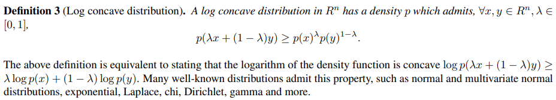

## b) Log-concave distribution:

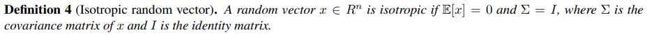

## c) First result:

For an isotropic distribution, the mean norm of x is sqrt(n), n being the number of dimensions. Elementary events
are therefore on a sphere with sqrt(n) radius.

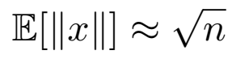

## d) Second result:

For an isotropic and log-concave distribution, the thickness of the sphere's shell is bounded according to this formula : 

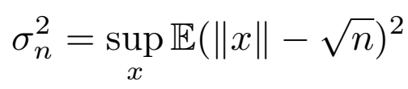

## e) Third result:

If we only know that the coordinates of the random variable X all have a mean of 0, and that the fluctuations
of the norm of x around its mean are small compared to this mean, then the mean norm of x
is approximately equal to the root of the trace of the covariance matrix.

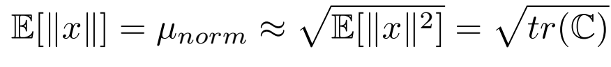

We can use an example to represent this in 2d. Let's take the case where x and y have a mean of zero,
different variances, and zero covariance (covariance only changes the orientation of the ellipse, which is not relevant
to the reasoning, so we can take zero covariance to simplify). 
Since the vectors have small fluctuations of norm relative to
the mean norm, these vectors are placed approximately on a circle with a radius equal to the mean norm. Since x and y have
different variances, we must expand/contract the circle on the x and y axes, and to keep the fluctuations low, 
the difference in variance between x and y have to be small relative to this mean norm. Ultimately, all
points are on an ellipse, and approximately on a circle
with radius equal to the root of the trace of the covariance matrix.

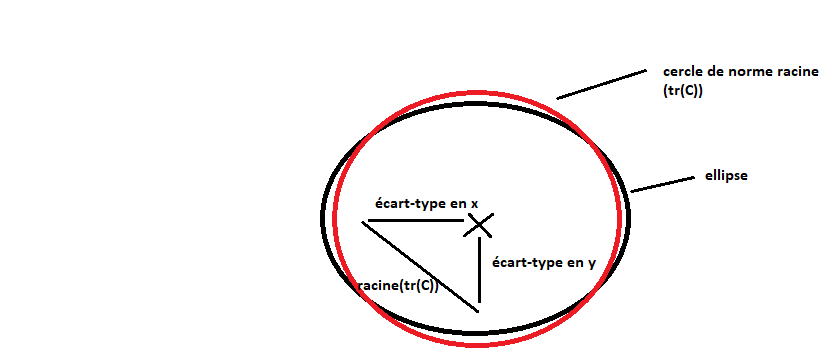

In this example, the x and y coordinates follow a uniform distribution over their possible values. For example, for x, for every possible value xi, there are two corresponding points (xi,+yi) and (xi,-yi).
In CLIP, we will see that the coordinates individually follow approximately a normal distribution
centered at 0. In two dimensions, it is difficult to see how such a distribution would allow us to maintain an average norm of root(tr(C)) without fluctuations, since we would have many vectors close to 0. Except that in CLIP, we have 512 dimensions and, as we saw in the third result, even if we do not have exactly the same
conditions here, the more dimensions there are, the more the thickness of the ellipsoid  shell will decrease. This explains why in CLIP we can have an average norm
root(tr(C)) even though the coordinates follow a normal distribution centered at 0.

# 2/ Analysis of the embedding space

The authors then begin to analyze the embedding space to deduce its properties.

## a) Modality gap:

Image and text vectors do not follow the same distribution. For example, for features 93 and 134, 
the researchers obtain these distributions.

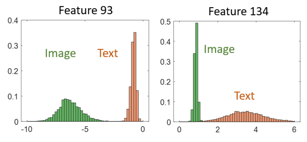

With these two features alone, they are able to linearly separate all image vectors from
text vectors.

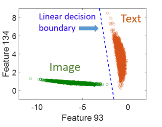

However, not all features are easily separable. They found nine that stand out, including 93 and 
134.

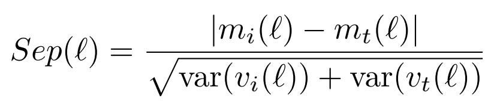
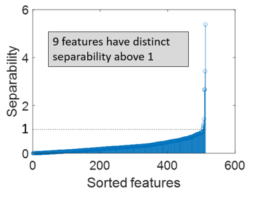

## b) Shape of the two distributions:

Taking the first 10 features of each distribution, they find that the values peak at 0.

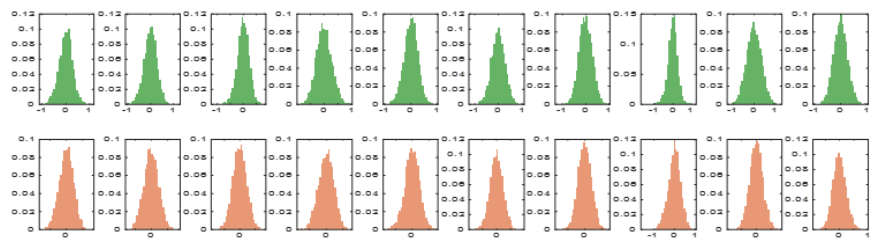

Conversely, the norm has a non-zero average value, with a much lower variance than the individual coordinates.

The authors conclude:

We know that with the third result, the average norm is root(tr(C)). For now, I don't understand when 
this information was useful in the article.

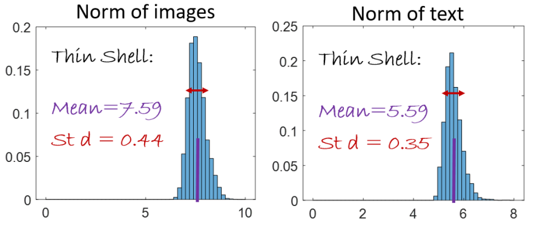

## c) Ellipsoidal shell:

Within a distribution (image or text), the authors observe that the features have different variances. They therefore conclude that the shell with radius
root of tr(C) is 
ellipsoidal and not spherical. Here, I am not sure how they arrive at this conclusion, but
here is a justification that I found. First, we define what it means to be on an ellipsoidal shell:
it is when the set of points has an approximately constant Malahanodis norm. At first glance, we might think that this 
is not the case for us, because the Euclidean distance is approximately constant at root(tr(C)) and the Malahanodis transformation
to recalculate a Euclidean distance will stretch/reduce certain coordinates, so it should
not be able to be constant as well.
However, when we look at the graph of feature variances, we see that the variances average around
0.1, and that higher variances are rare.

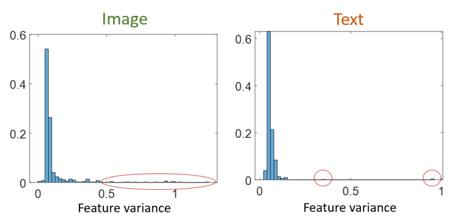

Thus, by deforming space with Malahanodis, the points
restricted to the features with the variance close to 0.1 will remain on a sphere, as all coordinates will have been stretched almost equally.
As the other coordinates are a minority, their modification should not have too much impact on the norm of the vectors,
which should remain close to the sphere. Ultimately, it is not contradictory to have a Euclidean norm and a constant Malahanodis norm
if the variances of the coordinates are on average the same. 
To find out whether the points are more on an ellipsoidal shell than a spherical one, we could recalculate the Malahanodis norm 
for these points and see if the variance around the mean value is lower than in the Euclidean case,
but I did not see this in the article.

## d) Ellipsoid orientation:

The authors calculate the off-diagonal dominance for each row of the covariance matrix to see if
the diagonal is dominant compared to the rest of the coefficients, in other words, whether the variables are correlated
or not. 

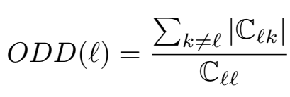

They observe significant values, meaning that the variables are correlated and therefore the ellipses
are tilted (as in 2 dimensions, where covariance implies that the axis of the ellipse is oriented according to this
covariance).

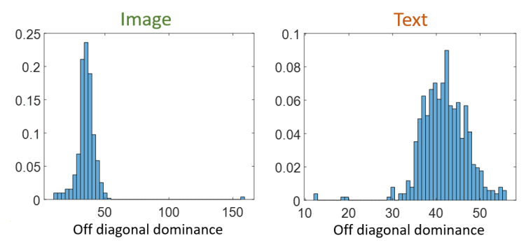

## e) Center of the ellipsoids:

The authors want to evaluate the distance from the center of the ellipsoids to the origin. To do this, they compare the standard deviation
to the mean vector.

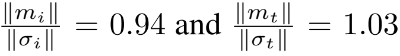

They find the same order of magnitude. This means that the ellipsoids are significantly distant from the origin.

# 3/ Justification for the two-ellipsoid structure

The authors then show that this division into two ellipsoids is optimal for CLIP loss.

## a) Transformation by an encoder of an input distribution into a distribution contained within an ellipsoid

I do not have an explanation for why an encoder transforms the initial distribution into a distribution that is 
centered around a value for each coordinate.
However, once we have a centered distribution for each coordinate, we know that the points of the distribution are
in an ellipsoid that has a radius for each coordinate approximately equal to the variance of the coordinate.

## b) How the two encoders work

Before explaining the origin of the other properties of ellipsoids, it is necessary to understand how the two encoders work.
Each encoder uses transformers that enable it to understand the meaning of the input. The encoder then synthesizes
the information it has extracted from the input into a vector in the embedding space.

The CLIP loss corresponds to the sum of the distance between the distribution of images and the one of texts, and the distance between the distribution
of texts and the one of images. To minimize this sum, each pair in the dataset must have a cosine similarity of 1, and the
vectors of this pair must have a cosine similarity of 0 with the vectors of different pairs. This global optimum, if it exists
with the chosen image and text encoder functions, is difficult to find. However, there is an easier local optimum.
For this, semantically similar images/texts must have similar embeddings. In this way,
the loss decreases because instead of having an average cosine similarity between all vectors, we will have an average cosine similarity
for vectors corresponding to semantically similar entries, and a cosine similarity close to 0 for the others.

So far, we have seen that encoders are capable of extracting information from their input, and that they must use this information to bring semantically similar vectors closer together. To do this, they must encode identical information in the same way,
and exhaustively extract all the information contained in their input. However, this exhaustive extraction is not possible,
because the input sometimes contains too much information. For example, in an image, the
information contained is infinite if we look for all the precise details. Encoders therefore learn to extract only the
information that, on average, is most useful for bringing the right pairs together.

## c) The existence of two distinct ellipsoids for the image encoder and the text encoder

We have seen that encoders do not exhaustively extract all the information from their input, but only that which is, on average, most useful for minimizing loss.
Thus, the information extracted by the two encoders for 
the same pair is not always identical: the text may have been very descriptive for a simple image, and the image encoder
seeing a simple image will extract little information, unlike the text encoder.

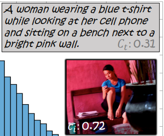

Here, the Ci/Ct indicate the average cosine similarity of the embedding with the other vectors of its modality. We can see that an image and
text from the same pair can have very different Ci/Ct, indicating that one encoder extracts common information related to
its modality, while the other extracts more precise and rare information.

Since both encoders encode information identically, but their sets of extracted information are not 
exactly the same, we obtain distributions in the latent space that are close but with differences. These differences 
vary in magnitude depending on the features, and are particularly significant for nine specific features. I have not found an explanation
for the concentration of differences on these nine features.

## d) Concentration of points on the shell of ellipsoids

The concentration of points on the shell is observed with the calculation of the mean norm and its variance, but it is not
explained why this concentration occurs. It is possibly due to the high dimension n = 512, as it is the
case for isotropic log-concave distributions.

## e) The offset of the ellipsoids relative to the origin 

### e.1) Compromise between uniformity and alignment

The authors rewrite the loss with an alignment term and a uniformity term.

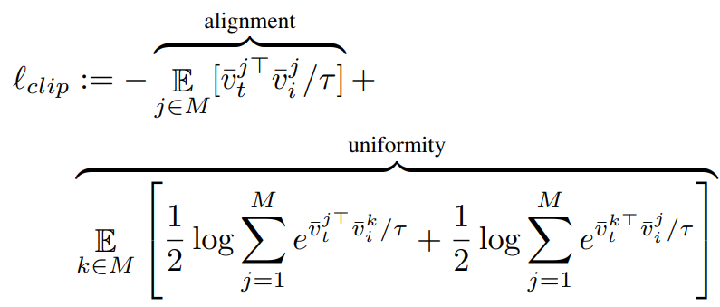

The alignment term brings the
vectors of the same pair closer together, and the uniformity term pushes the vectors of different pairs further apart. To reduce the loss,
we want to increase the alignment and decrease the uniformity.

To understand the shift of the ellipsoids, they move the ellipsoid of the images relative to the origin to see 
the evolution of the loss and specifically of these two terms.

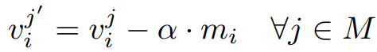

We observe that alignment increases as we move away from the origin, while uniformity decreases as we move closer to it.
The optimal loss corresponds to an ellipsoid centered on the mean vector that was found with training.

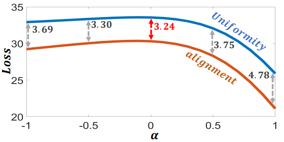

These different evolutions of alignment and uniformity can be explained.
The difference stems from the fact that for image encoder embeddings, the possible directions increase as they
approach the origin and decrease as they move away from it.
If we are close to the origin, it is therefore easier to
give vectors from different pairs different directions, which reduces uniformity. However, for 
embedding pairs that the model cannot bring together (e.g., noise in the inputs, encoders that do not extract the 
same information from the image and text), the cosine similarity of the pair will be weaker and the alignment will decrease.
The opposite happens as we move away from the origin, and ultimately the best center for the ellipsoid is a compromise
between uniformity and alignment.

## e.2) Handling false negatives

A false negative is a pair of images and text that are semantically close but are not a true pair in the dataset.
The key information extracted from these false negatives is similar, so they should be close in latent space, but not as close
as a real pair.

The problem with centering the ellipsoid at the origin is that a small shift in the vectors causes a
rapid drop in cosine similarity. Indeed, if we calculate the gradient of a cosine similarity with respect to a 
vector, we see that this gradient is inversely proportional to the norm of this vector.

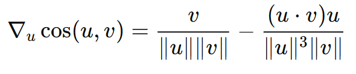

This means that it is difficult to have a high cosine similarity for false negatives, as they cannot be as close as true pairs are.
By moving the ellipsoid away from the origin, we decrease the gradient of the cosine similarity and thus increase the cosine
similarity of false negatives.

### e.3) Different encoding of common and rare information:

We take an encoder, for example the image encoder. If an image has frequently extracted information, it should 
have a higher average cosine similarity with other image embeddings than an image with rare information.
If the image ellipsoid is centered at the origin, with the embeddings on the shell, any embedding will have the same average cosine
similarity to the other embeddings regardless of its position on the shell. It is therefore impossible to differentiate between common images
and rare images. However, by moving the ellipsoid away from the origin, an embedding with a central direction
will have a higher average cosine similarity with the other embeddings than an embedding with an extreme direction.
The diagram below shows a simplified example with a sphere, but the same reasoning applies to an ellipsoid.

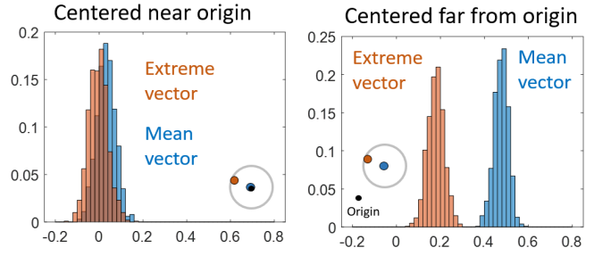

Thus, common images can be placed in embeddings directed towards the center and rare images in 
embeddings at the extreme directions of the ellipsoid.
