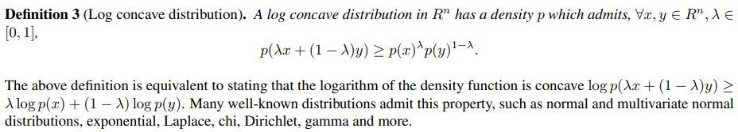
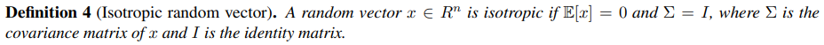
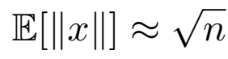
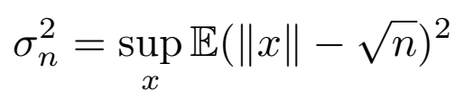
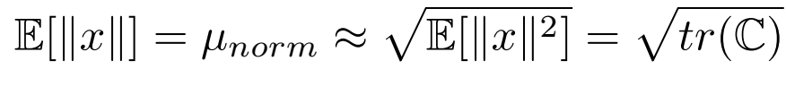

L'espace des embeddings de CLIP est de dimension 512 et contient à la fois les embeddings des phrases et les embeddings
des images.

# Thin shell theory :

Les auteurs donnent plusieurs résultats sur la géométrie d'une distribution dans un espace à plusieurs dimensions.
Avant cela ils donnent des définitions

## Variable aléatoire isotropique : 

## Distribution log concave :

## 1er résultat :

Pour une distribution isotropique, la norme moyenne de x vaut racine de n le nombre de dimensions. Les évènements
élémentaires sont donc sur une sphère de rayon racine de n.

## 2e résultat :

Pour une distribution isotropique et log concave, on a l'épaisseur de la coquille de la sphère qui est majorée par la
racine du logarithme de n.

## 3e résultat :

Si on sait seulement que les coordonées de la variable aléatoire X sont toutes de moyenne 0, et que les fluctuations
de la norme de x autour de sa moyenne sont faibles comparées à cette moyenne, on a que la norme moyenne de x
vaut environ la racine de la trace de la matrice de covariance.

On peut faire un exemple pour se le représenter en deux dimensions. On prend le cas où x et y sont de moyenne nulle,
de variance différente et de covariance nulle (la covariance change juste l'orientation de l'ellipse qui n'intervient pas
dans le raisonnement donc on peut prendre une covariance nulle pour simplifier). Les vecteurs ayant des fluctuations de 
la norme faible par rapport
à la moyenne de la norme, ces vecteurs sont placés sur un cercle de rayon la moyenne de la norme. Comme x et y ont
une variance différente, on doit élargir/rétrécir le cercle sur les axes x et y, ce qui ne modifie pas la norme moyenne
à condition que  la différence de variance entre x et y est faible par rapport à cette norme moyenne. Au final tous
les points sont sur une ellipse, et environ sur un cercle
de rayon la racine de la trace de la matrice de covariance.

En réalité dans des espaces de grandes dimensions les coordonnées n'ont pas besoin de valoir pile +/- l'écart-type,
elles peuvent êtres centrées autour de 0 suivant une loi normale, et on aura quand même des vecteurs de norme
moyenne la racine de la trace mais cela est du au nombre important de dimensions qui permet d'avoir un vecteur de
norme moyenne avec peu de fluctuations ce qui n'est pas représentable sur un graphe en 2d.
