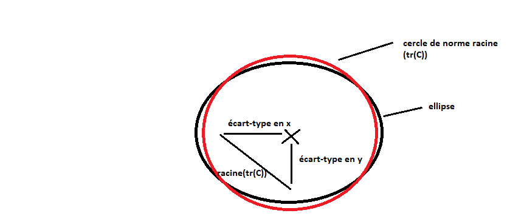

L'espace des embeddings de CLIP est de dimension 512 et contient à la fois les embeddings des phrases et les embeddings
des images.

# 1/ Thin shell theory :

Les auteurs donnent plusieurs résultats sur la géométrie d'une distribution dans un espace à plusieurs dimensions.
Avant cela ils donnent des définitions

## a) Variable aléatoire isotropique : 

## b) Distribution log concave :

## c) 1er résultat :

Pour une distribution isotropique, la norme moyenne de x vaut racine de n le nombre de dimensions. Les évènements
élémentaires sont donc sur une sphère de rayon racine de n.

## d) 2e résultat :

Pour une distribution isotropique et log concave, on a l'épaisseur de la coquille de la sphère qui est majorée par la
racine du logarithme de n.

## e) 3e résultat :

Si on sait seulement que les coordonées de la variable aléatoire X sont toutes de moyenne 0, et que les fluctuations
de la norme de x autour de sa moyenne sont faibles comparées à cette moyenne, on a que la norme moyenne de x
vaut environ la racine de la trace de la matrice de covariance.

On peut faire un exemple pour se le représenter en deux dimensions. On prend le cas où x et y sont de moyenne nulle,
de variance différente et de covariance nulle (la covariance change juste l'orientation de l'ellipse qui n'intervient pas
dans le raisonnement donc on peut prendre une covariance nulle pour simplifier). Les vecteurs ayant des fluctuations de 
la norme faible par rapport
à la moyenne de la norme, ces vecteurs sont placés sur un cercle de rayon la moyenne de la norme. Comme x et y ont
une variance différente, on doit élargir/rétrécir le cercle sur les axes x et y, ce qui ne modifie pas la norme moyenne
à condition que  la différence de variance entre x et y est faible par rapport à cette norme moyenne. Au final tous
les points sont sur une ellipse, et environ sur un cercle
de rayon la racine de la trace de la matrice de covariance.

Dans cet exemple, les coordonées x et y suivent une loi uniforme sur leur valeurs possibles. Par exemple pour x, il y a pour toute valeur
possible xi 2 points correspondant (xi,+yi) et (xi,-yi). Dans CLIP, on va voir que les coordonnées suivent individuellement une loi normale
centrée en 0. En deux dimensions, on ne voit pas comment une telle loi permettrait de garder une norme moyenne de racine(tr(C)) sans fluctuations, vu qu'on aurait beaucoup de vecteurs proches de 0. Sauf que dans CLIP, on a 512 dimensions et comme on l'a vu dans le 3e résultat même si on a pas ici exactement les mêmes
conditions, plus il y a de dimension plus l'épaisseur de l'ellipsoide va diminuer. Cela explique qu'on puisse dans CLIP avoir une norme
moyenne racine(tr(C)) bien que les coordonnées suivent une loi normale centrée en 0.

# 2/ Analyse de l'espace des embeddings

Les auteurs commencent ensuite à analyser l'espace des embeddings pour en déduire des propriétés.

## a) Modality gap :

Les vecteurs des images et des textes ne suivent pas la même distribution. Par exemple pour les feature 93 et 134, 
les chercheurs obtiennent ces distributions.

Ils sont capables avec ces deux seules features de séparer linéairement l'ensemble des vecteurs d'image de celui des
vecteurs de texte.

Par contre toutes les features ne sont pas facilement séparables, ils en trouvent 9 qui sortent du lot dont la 93 et 
la 134.

## b) Forme des deux distributions :

En prenant les 10 premières features de chaque distribution, ils constatent que les valeurs ont un pic au niveau de 0.

A l'inverse la norme vaut en moyenne une valeur non-nulle, avec une variance beaucoup plus faible que les coordonées
individuelles.

Les auteurs en concluent :

On sait qu'avec le 3e résultat, la norme moyenne vaut racine(tr(C)). Pour l'instant je n'ai pas compris à quel moment 
cette information était utile dans l'article.

## c) Shell ellipsoïdale :

Au sein d'une distribution, les auteurs observent que les features ont des variances différentes. Ils en concluent donc que la shell de rayon
racine de tr(C) est 
ellipsoïdale et non sphérique. Ici je ne suis pas sûr de comprendre comment ils en arrivent à cette conclusion, mais
voici une justification que j'ai trouvée. Premièrement on définit qu'est ce que c'est être sur une shell ellipsoïdale :
c'est quand l'ensemble de points à une norme de malahanodis environ constante. A première vue on peut penser que ce 
n'est pas le cas pour nous, car la distance euclidenne est environ constante a racine(tr(C)) et la transformation
de malahanodis pour recalculer une distance euclidienne va étirer/réduire certaines coordonées, donc elle ne devrait
pas pouvoir être constante elle aussi.
Cependant lorsqu'on observe le graphe des variances des features, il apparaît que les variances sont en moyenne autour
de 0.1, et que les variances plus élevées sont rares.

Ainsi en déformant l'espace avec malahanodis, les points
restreints à ces features vont rester sur une sphère comme toutes les coordonées auront été étirées presque de manière
égale. Les autres coordonées étant minoritaires, leur modification ne devrait pas trop impactée la norme des vecteurs
qui devrait rester proche de la sphère. Au final ce n'est pas contradictoire d'avoir une norme euclidienne et une norme
de malahanodis constante, si les variances des coordonées sont en moyenne les mêmes. 
Pour savoir si les points sont plus sur une shell ellispoïdale que sphérique, on pourrait recalculer la norme de 
malahanodis pour ces points et voir si la variance autour de la valeur moyenne est plus faible que dans le cas euclidien,
mais je ne l'ai pas vu dans l'article.

## d) Orientation des ellipsoïdes :

Les auteurs calculent la off-diagonal dominance pour chaque ligne de la matrice de covariance pour voir si
la diagonale est prépondérante par rapport aux restes des coefficients, autrement dit si les variables sont corrélées
ou non. 

Ils observent des valeurs significatives, signifiant que les variables sont corrélées et que donc les ellipses
sont penchées (comme en dimension 2 où une covariance implique que l'axe de l'ellipse est orientée selon cette
covariance).

## e) Centre des ellipsoïdes :

Les auteurs veulent évaluer la distance du centre des ellipsoïdes à l'origine. Pour cela, ils comparent l'écart-type
au vecteur moyen.

Ils trouvent le même ordre de grandeur. Cela signifie que les ellipsoïdes sont significativement éloignés de l'origine.

# 3/ Justification de la structure en deux ellipsoïdes

Les auteurs montrent ensuite que cette répartition en deux ellipsoides est optimale pour la loss CLIP.

## a) La transformation par un encodeur d'une distribution d'entrée en une distribution contenue dans une ellipsoïde

Je n'ai pas l'explication de pourquoi un encodeur transforme la distribution de départ en une distribution qui est 
centrée autour d'une valeur pour chaque coordonées.
En tout cas une fois qu'on a une distribution centrée pour chaque coordonée, les points de la distribution sont
dans une ellispoïde qui a pour chaque coordonée pour rayon environ la variance de la coordonnée.

## b) Le fonctionnement des deux encodeurs

Avant d'expliquer l'origine des autres propriétés des ellipsoïdes, il faut comprendre comment fonctionne les deux encodeurs.
Chaque encodeur fonctionne grâce à des transformers qui permettent de comprendre le sens des entrées. L'encodeur va synthétiser
l'information qu'il a extraite de l'entrée dans un vecteur de l'espace des embeddings.
Les encodeurs ne peuvent pas extraire exhaustivement toute l'information contenue dans l'entrée. Par exemple dans une image, les
informations contenues sont infinies si on va chercher tous les détails précis. L'encodeur apprend donc à extraire les informations
qui sont en moyenne les plus utiles pour diminuer la loss.

La loss de CLIP correspond à la somme de la distance de la distribution des images de celles du texte et de la distance de la distribution
du texte à celle des images. Pour minimiser cette somme, il faut que chaque paire du dataset est une cosine similarity de 1, et que les
vecteurs de cette paire aient une cosine similarity de 0 avec les vecteurs de paires différentes. Cette optimum global, si il existe
avec les fonctions d'encodeur d'image et de texte qui ont été choisies, est difficile à trouver. Il existe cependant un optimum
local plus facile. Pour cela, il faut que des images/textes sémantiquement proches aient des embeddings similaires. De cette manière,
la loss diminue car au lieu d'avoir une cosine similarity moyenne entre tous les vecteurs, on aura une cosine similarity moyenne
pour les vecteurs correspondant à des entrées sémantiquement proches, et une cosine similarity proche de 0 pour les autres.
Cet optimum local, en plus d'être plus facilement atteignable que l'optimum global, est favorisé par la forme des fonctions des encodeurs
qui avec les transformers ont la capacité de comprendre le sens des entrées.

## b) L'existence de deux ellipsoïdes distinctes pour l'encodeur d'image et l'encodeur de texte

On a vu que sur certaines coordonées (93,134) les distributions de valeur sont nettement séparées pour l'encodeur d'image et de texte.
Pour le comprendre on va revenir à l'objectif que doivent satisfaire les deux encodeurs pour diminuer la loss.
Les encodeurs doivent être capables de rapprocher des paires image/texte sémantiquement proches pour que la loss diminue.
Pour cela, ils apprennent à extraire des informations depuis leurs entrées. Cela est permis grâce à la construction
avec les transfomers qui permet d'analyser et faire le lien entre les différents composants de l'image/texte.
Les informations possibles à extraire d'une image sont très nombreuses : il existe une infinité de descriptions plus
ou moins précises pour la décrire. L'encodeur image doit donc faire un choix des informations en moyenne les plus utiles
à extraire pour faire correspondre ces images avec le texte. Ainsi les informations extraites par deux encodeurs pour 
une même paire ne sont pas identiques : le texte peut avoir été très descriptif pour une image simple, l'encodeur image
voyant une image simple va extraire peu d'informations contrairement à l'encodeur texte.

Maintenant il faut comprendre en quoi cette asymétrie d'extraction d'informations entraîne des distributions différents
à la sortie des deux encodeurs. Comme on l'a dit, la loss pousse les deux encodeurs à rapprocher les images et textes
dont les informations extraites sont identiques. Ainsi, une information si elle extraite par un encodeur doit
être encodé de la même façon par l'encodeur image et l'encodeur texte pour pouvoir rapprocher les vecteurs.
Comme les deux encodeurs codent identiquement les informations, mais que leurs ensembles d'informations extraites n'est 
pas exactement le même (on a vu que pour une même paire les informations extraites par l'encodeur image et l'encodeur 
texte peuvent 
être différentes), on obtient dans l'espace latent des distributions proches mais avec des différences. Ces différences 
sont plus ou moins grandes selon les features, et elles sont surtout importantes sur 9 features précises et je n'en ai
pas l'explication pour l'instant.
