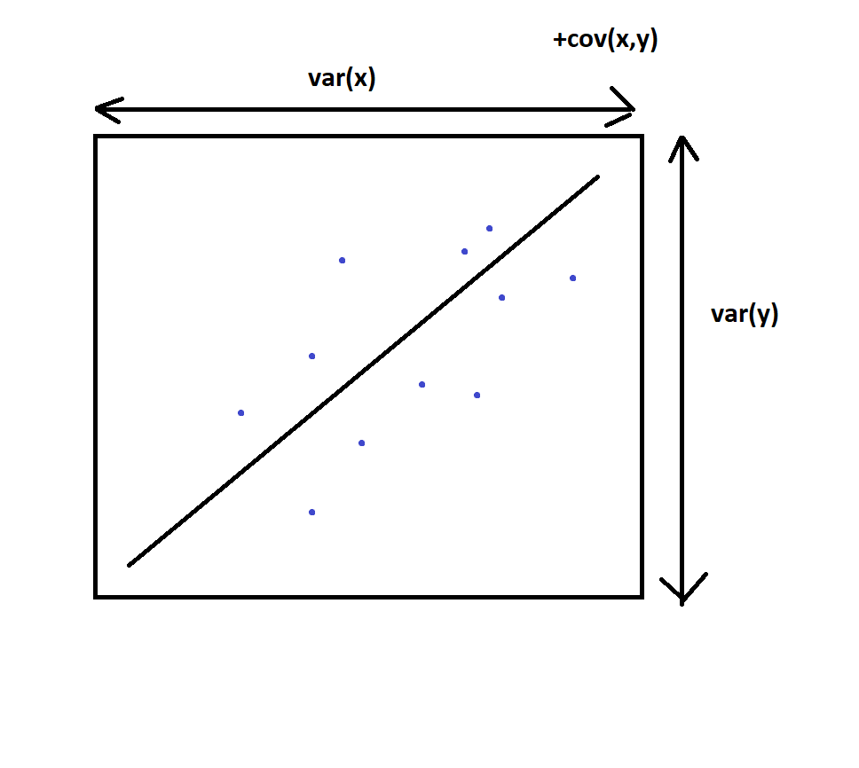
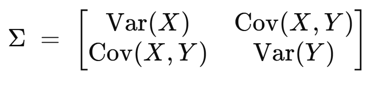
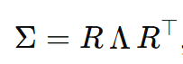
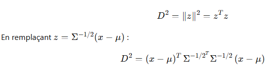

# Distance de malahadonis

On souhaite trouver une norme qui permette de calculer la similarité entre deux vecteurs issus d'une distribution.
La norme euclidienne n'est pas adaptée, car elle est invariante selon les directions, donc un vecteur qui est modifié de manière égale
sur une variable aléatoire à petite ou grande variance gardera la même distance au nouveau vecteur, alors que l'éloignement par rapport 
à la distribution est plus important dans le cas de la modification sur la petite variance.

# Solution :

Rappel : 

Dans une distribution de probabilités, la variance nous donne les bornes dans lesquelles les données se trouvent,
tandis que la covariance nous indique la direction que ces données prennent.

  
  

Pour construire une distance de malahanobis à partir de notre distance euclidenne, il faut normaliser les distances sur 
l'axe de corrélation et l'axe perpendiculaire proportionnellement aux variances des variables aléatoires. 

On utilise pour cela la 
racine de la matrice de covariance (on prend la racine car on normalise avec les écarts-types et pas la variance). 
La matrice de covariance nous donne sur la diagonale les normalisations dans 
la base canonique, et les autres termes de covariance permettent de recalculer cette normalisation dans les
directions de corrélation. Par exemple en deux dimensions :

Pour illustrer le fonctionnement de cette matrice, on peut voir comment elle transforme un vecteur. Comme elle est
symétrique, on peut la diagonaliser avec des matrices de rotation. 

Lorsqu'on multiplie un vecteur par cette matrice,
il va donc être exprimé dans une nouvelle base créée par rotation de la première, puis être normalisé sur les 
axes de la nouvelle base avec les coefficients de diagonale, puis retourner en sens inverse pour revenir à la base
de départ. On normalise donc suivant les axes qu'on voulait : axe de corrélation et axe perpendiculaire.

En réalité dans le calcul, on utilise l'inverse de la racine de la  matrice de covariance car 
la matrice de covariance augmente les distances dans les directions où la variance est grande ce qui est l'inverse 
de ce que l'on veut. Au final,
ce que fait l'inverse de la racine de la  matrice de covariance c'est transformé l'ellipse de l'espace de départ en 
un cercle
dans l'espace d'arrivé, et la distance de malahanobis est la distance euclidienne calculée sur ce cercle.

