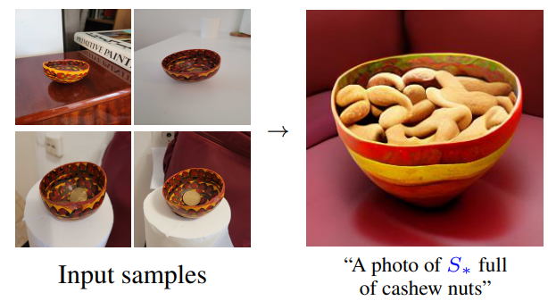
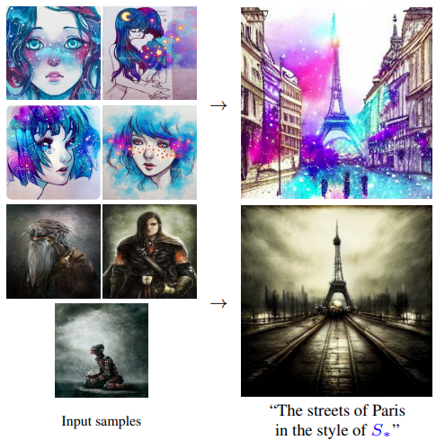
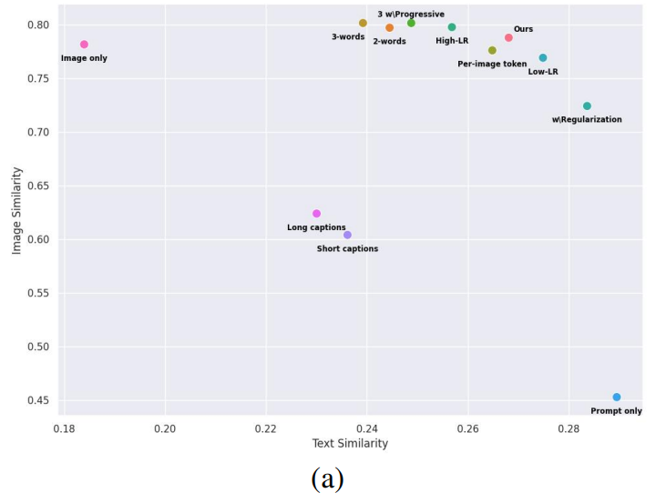
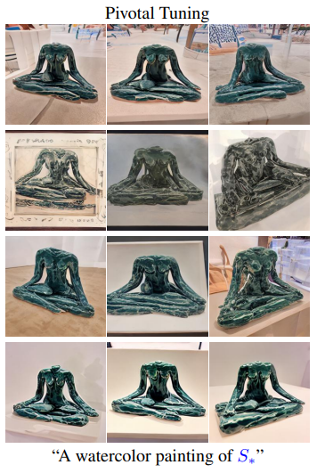

# Modifier une image dans un modèle de diffusion

Article : https://arxiv.org/pdf/2208.01618

Dans un modèle de diffusion, on génère l'image à partir d'un prompt là où avec un GAN on part d'un latent w. Pour modifier une image dans le modèle de diffusion, on modifie les mots
du prompt là où dans le GAN on se déplace selon des directions spécifiques dans W.
Cette comparaison nous permet de comprendre comment modifier une image dans un modèle de diffusion en s'inspirant de la méthode pour les GANs. 
On créé un ou plusieurs tokens (on choisit combien de tokens on veut pour représenter notre image) et on optimise leurs embeddings pour obtenir la meilleure reconstruction.
Ensuite on place ces tokens dans différents prompts pour modifier l'image.

Pour initialiser les embeddings de ces tokens, on peut choisir comme valeur de départ l'embedding de la classe à laquelle appartient notre concept (par exemple si c'est un animal
on peut prendre l'embedding du token lion, tigre ...). On choisit un prompt comme "a photo of s*1 s*2 s*3 etc." pour générer les images lors de l'entrainement.

Dans l'article, les auteurs ont exploré cette méthode d'inversion sous différents angles pour voir ses capacités et ses limites dans le cas du modèle de diffusion.

# Capacités :

## Compréhension sémantique

Même si le modèle est entrainé à représenter l'image de l'objet en entier et pas son interaction avec l'environnement, il comprend sémantiquement
sa constitution et peut le faire interagir avec d'autres objets. Par exemple si on apprend un bol spécifique il va pouvoir contenir
des objets à l'intérieur, comme tout autre bol.

## Idées abstraites

Le modèle ne se limite pas à l'apprentissage d'objets concrets mais peu aussi saisir des idées abstraites comme
un style de dessin avec ce type de prompt : “A painting in the style of s*”

# Limites :

## Interaction entre nouveaux objets

Les objets étant appris avec un set d'image où ils sont au coeur de la scène, le modèle a du mal a les faire
interagir entre eux (il peut les faire interagir avec des concepts qu'il connaît déjà comme on l'a vu, c'est l'interaction entre nouveaux concepts qui
pose problème). Il est possible que réaliser un entrainement où ils sont en interaction
avec d'autres nouveaux objets et non plus au coeur de la scène débloque cette situation.

# Evaluation de la méthode :

On peut faire varier la méthode d'inversion en changeant  certains hyperparamètres : learning rate, formule de la loss, nombre de tokens ...
La variation de ces hyperparamètres ne modifie pas les capacités/limites qu'on a vu avant qui sont propres à la méthode.
Néanmoins, en restant dans le cadre de ces capacités/limites, ils peuvent améliorer la reconstruction et l'editability s'ils sont bien choisis.
Il faut donc des méthodes pour évaluer ces deux critères afin de prendre les meilleurs hyperparamètres.

## Reconstruction

On veut évaluer si le concept généré ressemble au concept du dataset.
On génère 64 images, on les encode ainsi que les images du dataset dans l'espace d'embeddings de CLIP, on calcule
la cosine-similarity de toutes les pairs image générée/image du dataset et on en fait la moyenne.

## Editability

On veut évaluer à quel point le concept appris est modifiable. Pour cela on créé des prompts avec des variations
de décor, de style, et d'interaction avec d'autres objets. Pour chaque prompt, on génère 64 images, on fait une
moyenne du vecteur dans l'espace des embeddings de CLIP, et on calcule sa cosine-similarity avec le prompt utilisé
pour la génération à qui on a enlevé le nouveau token "a photo of S* on the moon" -> "a photo of on the moon".

# Choix des hyper-paramètres

Les auteurs de l'article ont analysé l'impact des différents hyperparamètres sur la reconstruction et l'editability en utilisant les méthodes ci-dessus,
ce qui donne une idée de quoi changer selon notre objectif.

## Implémentation de base

L'implémentation a été faite sur un ancien modèle précédent Stable Diffusion donc les paramètres ne sont peut
être pas exactement les mêmes dans ce cas, mais ils donnent quand même une idée du point de départ :

- Pour l'embedding du nouveau mot, on prend comme vecteur de départ le vecteur de la classe à laquelle est rattachée
notre objet (ex : chat, homme, arbre ...)
- 5 images dans le dataset
- 0.005 LR
- 4 batch-size
- 5000 steps

## Déplacement sur la courbe editability/distorsion

Les auteurs ont observé l'existence d'une courbe editability/reconstruction, et plus le/les vecteurs pris dans l'espace des embeddings
s'éloignent de l'embedding initial de la classe (ex : lion, tigre ...), plus on gagne en reconstruction tout en perdant en editability. 

Sur ce graphique, une augmentation en image similarity indique une meilleure reconstruction, et une augmentation en text similarity indique une meilleure editability (conformément
aux deux méthodes d'évaluation qu'on a vu précédemment). Il y a donc une courbe en haut a droite sur laquelle les différentes configurations sont positionnées, chaque configuration privilégiant plus ou moins la reconstruction/editability par rapport aux autres.

Ce compromis est le même que l'on observait
avec les styleGAN  : lorsque le/les latents s'éloignaient de l'espace W où le générateur avait été entrainé, on gagnait en reconstruction et perdait en editability.

Au final, la variation des hyperparamètres va éloigner plus ou moins les nouveaux tokens de l'embedding initial, il faut donc les choisir selon là où l'on veut être sur la courbe : soit on veut privilégier la reconstruction, soit l'editability.

#### Gagner en editability

Pour gagner en editability il faut se rapprocher de l'embedding de départ. 

##### Diminuer le learning rate

Avec un learning rate plus faible on s'éloigne moins de l'embedding de départ avec un même nombre de steps.

##### Régularisation

On peut introduire dans la loss une norme L2 entre le nouvel embedding et l'embedding de la classe de l'objet, de manière à privilégier avec l'optimisation le changement de
direction du nouvel embedding plutôt que son éloignement de l'embedding de départ.

#### Gagner en reconstruction

##### Augmenter le learning rate

Augmenter le learning rate augmente la reconstruction pour les mêmes raisons que le diminuer augmente l'editability.

##### Augmenter le nombre de tokens appris

On peut choisir d'apprendre plusieurs embeddings au lieu d'un, ou même d'apprendre un embedding
commun pour toutes les images et un différent de manière à ce que le modèle concentre les informations communes
dans l'embedding partagé et que les emebeddings spécifiques récupères les informations particulières à chaque image
qui ne nous sont pas utiles. Ces méthodes se rapprochent de celles du styleGAN lorsqu'on choisissait d'inverser dans W*k au lieu d'W* pour avoir une meilleure reconstruction,
et de la même manière elles éloignent plus les nouveaux tokens de l'embedding initial en multipliant les vecteurs.

Toutefois ces méthodes par rapport au token unique apporte un très léger gain en
reconstruction voir aucun, et une perte beaucoup plus importante en flexibilité. On peut le voir sur le graphe avec les configurations "3-words", "2-words" et "per image token"
comparées à "ours".

Au final, le réglage du learning rate est la méthode la plus simple pour se déplacer sur la courbe.

## S'affranchir de la courbe editability/reconstruction : le pivotal tuning

Dans le styleGAN pour s'affranchir de la limite imposée par la courbe, on découpe l'inversion en deux étapes.
On inverse l'image dans W pour avoir une bonne editability, et ensuite on finetune le générateur afin de modifier
les valeurs prises localement près de w. Ainsi on obtient une bonne reconstruction en profitant de l'editability
des points de W. Pour le modèle de diffusion, on peut appliquer cette même méthode en finetunant l'unet (on ne finetune pas aussi le text encoder car on ne veut pas
modifier la sémantique dans l'espace des embeddings mais seulement modifier l'apparence de certains embeddings ce qui est géré par l'unet).
Toutefois, les auteurs de l'article ont observé  qu'appliquer cette méthode dans le cas du modèle de diffusion n'est pas aussi efficace et fait perdre l'editability qui aura du être préservée par le finetuning. Ils proposent des idées pour modifier ce finetuning, mais qu'ils n'ont pas encore exploré.

Ces images correspondent à la génération d'un prompt étant censé placée la sculpture dans un tableau, avec à chaque fois un guidance scale s (paramètre qui influe sur a quel point
l'unet va prendre en compte le prompt pour générer l'image) plus élevé : 1,2 et 5. Au final le modèle est incapable de placer la statue dans un tableau donc on a perdu en editability.

## Augmenter le nombre d'images dans le dataset

Le nombre d'image affecte peu la reconstruction, un nombre optimal de 5 est trouvé pour l'editability.
