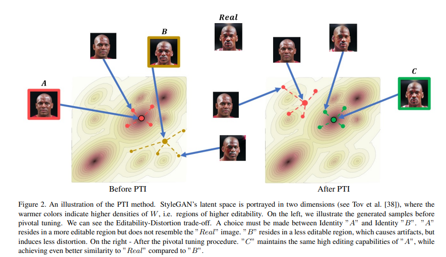
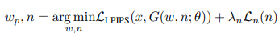
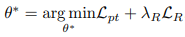

# Se libérer de la limite distortion/perceptual quality + editability

Article : https://arxiv.org/pdf/2106.05744

Quand on inverse une image dans W, on préserve la perceptual quality + editability, et même si la distortion
est plus élevée que dans W*k, l'image générée reste proche de l'image d'origine. On peut donc essayer de finetuner
le générateur pour que en ce point w, on obtienne exactement l'image d'origine, ce qui devrait pouvoir se faire
sans modifier la sémantique de l'espace W, mais en changeant uniquement l'apparence des latents proches de w.
Le point w est appelé le pivot.
C'est ce qu'illustre ce graphique issu de l'article où l'on voit que l'espace où W est dense a gardé sa sémantique
(en changeant de direction on modifie l'orientation du visage), et l'apparence que prend G sur cet espace a légèrement
changé pour se rapprocher de l'image d'origine.

## Inversion

On trouve un latent dans w et un bruit n pour générer une image proche de la cible, et ce par optimization.

Ici le bruit est une partie intégrante des entrées car il définie les motifs aléatoires à plusieurs étapes de synthèse,
par exemple la forme globale des cheveux à la première couche de synthèse, et ensuite les motifs plus précis des 
mèches à la dernière. Il faut donc aussi optimiser ce bruit pour se rapprocher au plus près de l'image voulue. 
La loss est ainsi constituée de deux termes : un terme de différence entre l'image générée et l'image cible, et un 
terme de régularisation du bruit qui s'assure que les paramètres du bruit sont décorélés et ne stockent que des 
valeurs aléatoires, et pas des informations sémantiques qui sont réservées à w.

## Tuning

Pour le tuning, on a en loss un terme pour la différence entre l'image cible et l'image générée avec le latent, et un
terme de régularisation qui a pour but de forcer le tuning à rester local autour de w.

Pour le terme de régularisation, on tire un vecteur dans Z, on le transforme en latent wz, et on réalise une interpolation entre
wp et wz, dont la distance à wp est mesurée par un coefficient alpha.
Une fois qu'on a ce vecteur interpolé wz, on génère une image
avec l'ancien générateur et une image avec le nouveau et on fait la différence, le but étant de ne pas s'éloigner
de ce que produisait le générateur d'origine. Le but est d'appliquer la régularisation à 
bonne distance de wp, suffisament loin pour que le finetuning local ait lieux, mais pas trop éloigné car les
latents trop distants ne seront de toutes façons pas affectés par le finetuning donc il faut cibler ceux juste
après la zone délimitée par le finetuning local. Pour cela il faut choisir la bonne valeur de alpha.

