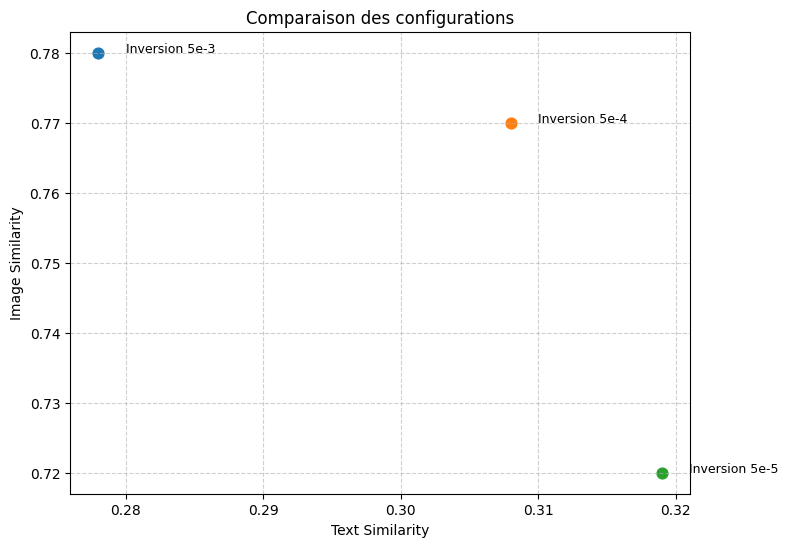
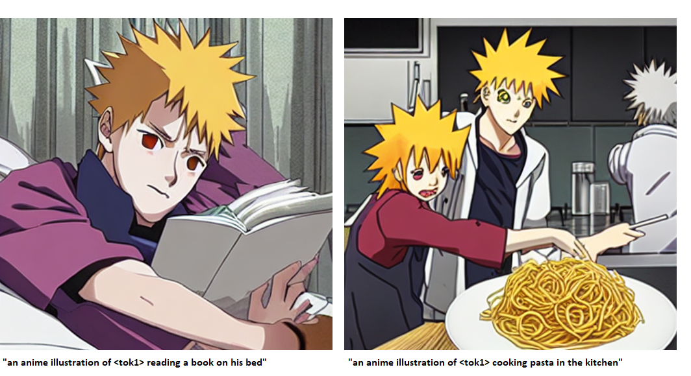
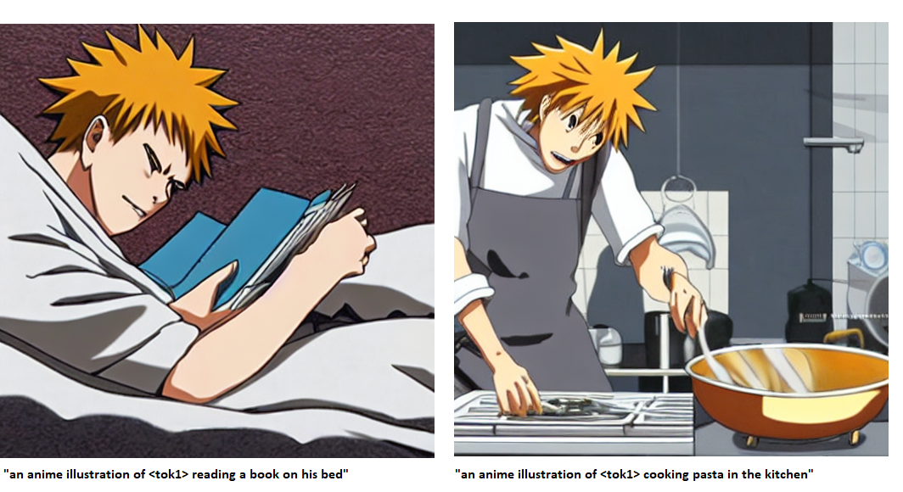
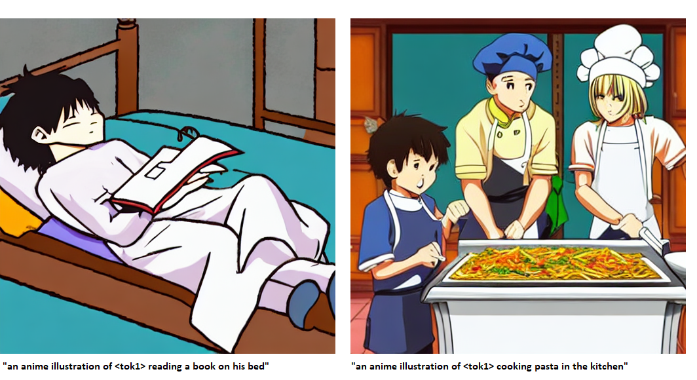
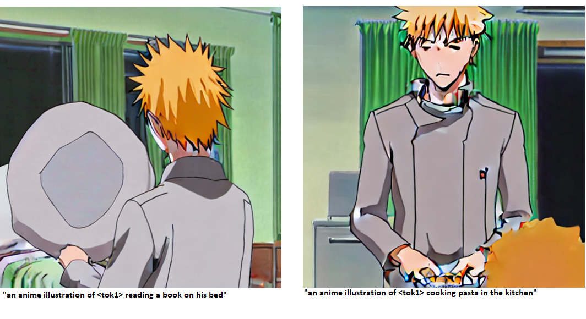
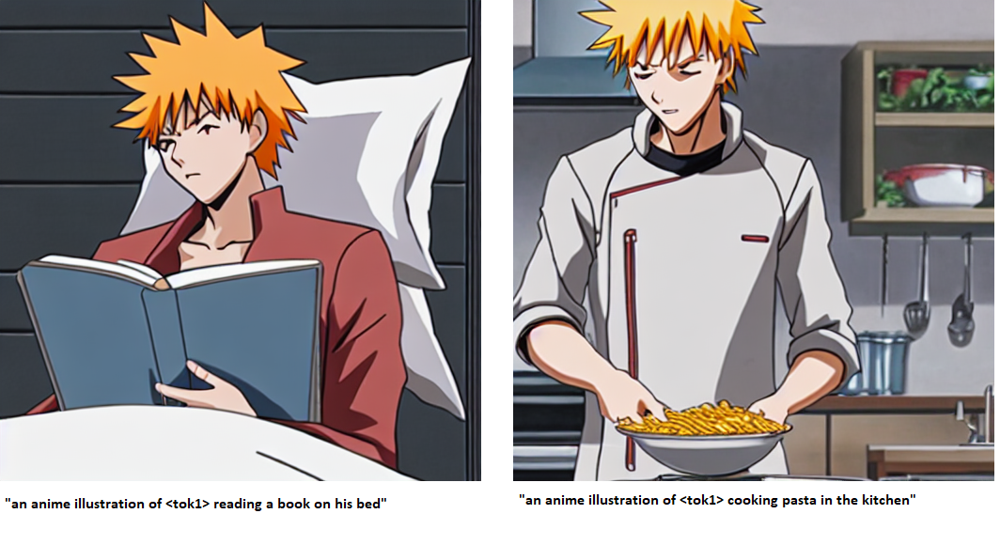
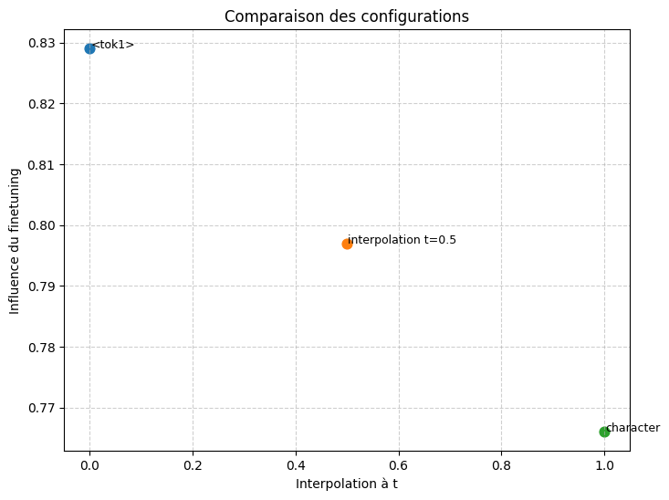
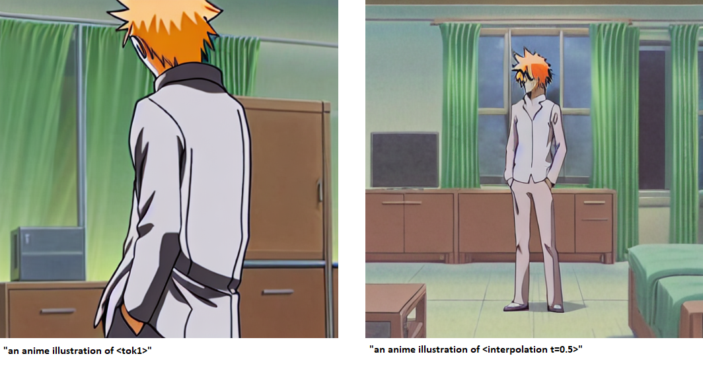
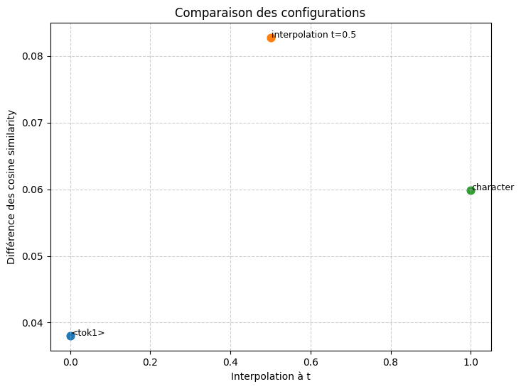

# Introduction

Je présente les résultats importants que j'ai pu déduire de la lecture des articles et des tests effectués avec les notebooks pour parfaire le pivotal tuning d'un modèle de diffusion. 

A chaque étape je résume ce que j'ai tiré des articles sans justification, pour voir les détails du raisonnement tout est dans les résumés individuels des articles.

Pour toutes ces étapes, on prend un nombre
de steps constant de 1000 pour ne pas
éterniser l entrainement, et on étudiera 
l'influence des autres parametres.

# Choix du learning rate pour l'inversion

Dans notre cas contrairement
au styleGAN,
l'inversion n'est pas gratuite. En effet en s'éloignant du token de départ, on perd en editability, là où dans le styleGAN avec l'inversion on reste en permanence dans W. Dans l'idéal, il faudrait qu'il y ait une première période où en s'éloignant du token de 
départ on gagne beaucoup en reconstruction et on perd peu en editability, et une seconde période où le gain en reconstruction est plus
faible et la parte en editability plus importante. Il faudrait alors inverser à la distance limite entre ces deux périodes.

Il faut donc qu'on mesure l'évolution de la reconstruction et de l'editability en fonction de l'éloignement au token, pour voir à quelle distance on doit inverser. Pour parcourir différentes distances, on utilise le fait que la distance parcouru vaut environ nb steps x learning rate, ce qu'on pourra confirmer en calculant la norme euclidienne entre le token obtenu avec l'entrainement et le token de départ. On réalise les mesures sur 3 learnings rates : 5e-3, 5e-4 et 5e-5.

L'intersection entre les deux périodes qu'on avait prévues se trouve à 5e-4, on va donc utiliser ce learning rate.

De plus on peut confirmer que le token s'éloigne bien avec l'augmentation du learning rate : 

Voici quelques images générées avec les trois learning rates pour visualiser les différences :

> LR = 5e-3

> LR = 5e-4

> LR = 5e-5

# Choix du learning rate pour le finetuning

Dans le styleGAN ils disent qu'ils 
appliquent un "léger" finetuning qui
leur permet de gagner en reconstruction
sans perdre en editability. Il faut donc définir qu'est-ce qu'un finetuning léger
avant de pouvoir trouver le bon learning
rate. Pour cela on va expliquer le fonctionnement général du finetuning.

Lors d'un finetuning une fonction apprend différents concepts. Par exemple en finetunant notre fonction sur un personnage, la fonction apprend son apparence, mais aussi des éléments non voulus comme sa position, l'environnement dans lequel il se situe. Les concepts dont la différence est la plus faible entre l'état de base et le dataset de finetuning seront améliorés les premiers car la fonction G dans l'espace des fonctions aura moins de distance à parcourir pour les améliorer. Par exemple, si un personnage dans le dataset contient plusieurs positions différentes, pour apprendre ces positions le modèle devra déjà abandonner le fait qu'il produit des positions aléatoires pour le token associé à ce personnage, et en plus il ne pourra apprendre une position donnée que lorsqu'il passe sur l'image du dataset avec cette position. Pour l'apparence, l'état de base de la fonction est déjà proche de l'état d'arrivée grâce à l'inversion, et chaque image du dataset contribue également à améliorer l'apparence donc elle sera améliorée beaucoup plus vite que la position.

Si on veut améliorer un concept précis comme l'apparence, il faut donc qu'on se déplace pas plus loin que la distance permettant de modifier ce concept et pas les autres. C'est cela que les auteurs du pivotal tuning veulent dire quand ils parlent de finetuning léger. 

Pour trouver la bonne distance de finetuning, on essaie différents learning rate pour trouver la distance limite où
on commence a apprendre les positions, et on s'arrête juste avant. On réalise les mesures sur 2 learnings rates : 1e-4 et 1e-5.

> LR = 1e-4

> LR = 1e-5

On voit que à 1e-5 seule l'apparence est apprise, et qu'ensuite d'autres features comme la position et l'environnement se rajoute à l'apprentissage. On
va donc choisir un learning rate de 1e-5.

# 3/ Régularisation

## A) Utilité de la régularisation pour le modèle de diffusion

### a.1) La régularisation dans styleGAN

Lorsque qu'on finetune G sur un latent wp, le finetuning va déborder sur les latents aux alentours,ce débordement
diminuant avec la distance. Le problème, c'est qu'on a qu'un seul modèle, donc on ne peut pas se permettre
de perdre toute la capacité de génération de visages de G juste pour apprendre une seule personne.
Il faut donc éviter ce débordement.

Pour cela, on ajoute un terme de régularisation, qui force G à coller au modèle de base sur les latents proches de wp.
Si on prend un latent où on régularise wr, et qu'on note tr le terme de régularisation et te le terme d'entrainement,
tout va se passer comme suit :
grad(G(wp)) = 0.1\*grad(tr) + 0.9\*grad(te)
grad(G(wr)) = 0.1\*grad(te) + 0.9\*grad(tr)
(les coefficients 0.1/0.9 ne sont pas exacts c'est juste pour montrer que selon le gradient un terme où l'autre va plus être pris en compte).
Ainsi les modifications de G sur wr par te vont être négligeables devant la régularisation, et le freinage de 
l'apprentissage de G sur wp par tr sera négligeable devant le terme d'entrainement. On peut donc
préserver les visages situés autour du pivot sans trop freiner l'apprentissage.

### a.2) Regularization on styleGAN = regularization on diffusion model ?

To apply regularization to the diffusion model, we work in the embedding space after the CLIP transformer, which is trained to establish a relationship between geometry and semantics, unlike the embedding space after the tokens.
We might then wonder whether regularization applied exactly as in StyleGAN is useful to us.
Actually, it's not, because with LORAs we can easily load/unload a configuration so it is not a problem if learning affect nearby embeddings.

### a.3) Select features learned through regularization

However, regularization can be useful in another way.
During fine-tuning, the embedding $\langle tok1 \rangle$ will learn all the features of the dataset: appearance, position, environment, etc.
(When I say “the embedding tok1 will learn,” it's a shortcut for saying that G will change its values on tok1).
To prevent it from learning useless features, we could add a regularization term that forces $\langle tok1 \rangle$, on the features
we don't want to learn, to remain identical to the version before fine-tuning.

This way, we would no longer have to limit the distance 
traveled by G with a small learning rate to avoid learning parasitic features.
We can increase the learning rate so that G covers a larger area of the function space
and find a better reconstruction.

The overfitting limit where the positions and environment were learned was found to be at lr = 1e-4.
Next, we will use this learning rate and see if we can cancel out the learning of positions and environment.

## B) Interpolate between two embeddings

We know that the manifold of text embeddings in CLIP is an ellipsoid
that can be approximated by a sphere, as most coordinates have the same variance.
This sphere is offset from the origin. 
However, this is only true for the last sentence/image token embeddings, which are the ones on which
the CLIP loss is based. We know nothing about the other embeddings. Yet it is these other embeddings that are passed
in matrix form to the diffusion model.

Since character/$\langle tok1 \rangle$ are in the middle of the sentence at index 5, we can try to see if the embeddings at index 5
of a sentence follow the same distribution in space as the end embeddings. To do this, I took
the same dataset used by the researchers to determine the manifold of end embeddings (MS-COCO 2014),
and I calculated the mean norm and the variance of this norm. In the end, I obtained the same result
as for the end embeddings: norm of 24 and variance of 1. We will therefore be able to perform a vSLERP for our embeddings at position 5, as 
the researchers do on the end embeddings.

However, there is a problem in my code because when calculating the mean norm and variance for the end token (I should therefore have the same result as in the article), I get a lower variance with the basic embeddings than with the centered embeddings, which is not consistent with the shift of the text ellipsoid from the origin that the authors showed. I get exactly 27 for the norm and 0.1 for the variance with non centered embeddings. So I will do a SLERP and not a vSLERP until this problem is resolved.

## C) The appearance prompt

Before we can find the term for regularization, we will demonstrate a property.

### c.1) Problem modeling

We begin by modeling our situation mathematically.

We model a prompt/image using two variables, $x$ : appearance, and $y$ : other features, which summarize the information contained in the prompt/image.
In what follows, we consider that the other features are solely the environment, $y$: environment, which does not change the reasoning and allows for better visualization.

The function $G$ is the Unet that transforms a prompt into an image:

$$
G(x_t, y_t) = G_1(x_t),G_2(y_t)
$$

where $G_1$ transforms the text appearance into image appearance and  $G_2$ transforms the text environment into image environment.

Let's take the training prompt: “an anime illustration of $\langle tok1 \rangle$ ".

Initially, the function $G$, which we will annotate as $G_a$, is:  

$$
G_a(\text{“an anime illustration of \<tok1>”}) = G_a(x_t = \langle tok1 \rangle,\, y_t = \langle tok1 \rangle) 
= G_{a1}(\langle tok1 \rangle),G_{a2}(\langle tok1 \rangle) 
= G_{a1}(\langle tok1 \rangle),\text{random}
$$

This is because the appearance and environment information are included in  $\langle tok1 \rangle$.  
In terms of appearance, it resembles our target character thanks to inversion.  
In terms of environment, it is generated randomly because  $\langle tok1 \rangle$ does not contain any information about the environment.

At the end of training:  

$$
G_b(x_t = \langle tok1 \rangle,\, y_t = \langle tok1 \rangle) 
= G_{b1}(\langle tok1 \rangle),G_{b2}(\langle tok1 \rangle)
$$

We would like:  

$$
G_{b2}(\langle tok1 \rangle) = \text{random}
$$

but this is not the case because the token  $\langle tok1 \rangle$  has been associated with both the appearance **and** the environment of the dataset.

### c.2) Exitence of the appearance prompt

We would like to demonstrate that there exists a prompt $(x_t, y_t)$, such that:  

$$
G_b(x_t, y_t) = G_{a1}(\text{char1}) + G_{b2}(\langle tok1 \rangle)
$$

where $G_{a1}(\text{char1})$ is a character appearance known by $G_{a}$, with $G_{a1}(\text{char1})  \neq  G_{b1}(\langle tok1 \rangle)$
so it is not affected by the finetuning.

Let's take the prompt, which we will call **appearance prompt**: $\text{“an anime illustration of } \langle tok1 \rangle \text{ woman with long blue hair”}$

We take:  

$$
\text{char1} = \text{“woman with long blue hair”}
$$  

We have :   

$$
G_b(\text{“an anime illustration of } \langle tok1 \rangle \text{ woman with long blue hair”}) = 
\big( p \cdot G_{b1}(\langle tok1 \rangle) + (1-p) G_{b1}(\text{char1}), G_{b2}(\langle tok1 \rangle) \big)
$$  

which can also be written as:  

$$
G_b(\text{“an anime illustration of } \langle tok1 \rangle \text{ woman with long blue hair”}) = 
\big( p \cdot G_{b1}(\langle tok1 \rangle) + (1-p) G_{a1}(\text{char1}),G_{b2}(\langle tok1 \rangle) \big)
$$  

since $G$ does not change its values on $char1$ with training.

The model constructs the appearance with a percentage taken from  $\langle tok1 \rangle\$ and a percentage taken from   $char1$

If we could get $p = 0$, the prompt would satisfy the property.  By testing this prompt on the model trained at $10^{-4}$,  we see that, on the contrary, we have $p = 1$.

To reduce this percentage, we can try to increase editability by interpolating between $\langle tok1 \rangle$ and character.
In fact, fine-tuning causes a loss in $\langle tok1 \rangle$ editability, and this loss decreases with distance. However, the effect
of fine-tuning decreases with distance, so we must ensure that even with distance, we still have:

$$
G_{b2}(interpolation) = G_{b2}(\langle tok1 \rangle\)
$$

We will therefore interpolate between tok1 and character, measure the influence of fine-tuning and editability,
and choose an optimal point. To measure the influence of fine-tuning, we calculate the cosine similarity
of the generated images with those in the dataset. To measure editability, we generate images using the simple prompt and the appearance prompt from the interpolated point
and calculate the cosine
similarity between the two. The decrease in similarity in this case will be due to the inclusion
of the appearance terms in the appearance prompt.
Since we plan to regularize fine-tuning at 1e-4, we perform these measurements on the model fine-tuned
at 1e-4.

### c.3) Interpolation results

We have these evolutions of the influence of fine-tuning and editability with interpolation.

The influence decreases linearly while editability increases logarithmically. It would therefore be beneficial to take the interpolation at t = 0.5,
which gives us the best compromise between editability and the influence of fine-tuning.
However, when analyzing the images generated by the interpolations, we realize that the evolution of editability does not accurately represent the extent to which
appearance terms take precedence over $\langle tok1 \rangle$. In fact, appearance terms seem to be taken into account much more at t = 1,
which is not highlighted by the curve.

One explanation is that by moving away from $\langle tok1 \rangle$, the generator avoids overfitting and generates more random images. 

Thus, editability will decrease significantly between t= 0 and 
t = 0.5 because the cosine similarity will be decreased by the randomness of instance, even if the appearance is only slightly modified by the appearance prompt. To verify this, we change the measure of editability. We calculate the cosine similarity
between images generated with the same prompt, and we compare it with the cosine similarity of images generated with the simple prompt and the appearance prompt.
By calculating the difference between these two cosine similarities, we should be able to
quantify only the evolution of the consideration of appearance in the generation, without being confused by the increase in randomness.

Ultimately, the evolution of editability is still not representative of the consideration of appearance terms. I therefore decided to follow my observation
and regularize at t = 1, where we see that appearance is indeed modified and that other features such as environment and positions remain influenced by
fine-tuning, even though I am unable to
find a formula to substantiate this observation.

## D) The regularization term

### d.1) Finding the regularization term

The two previous points allowed us to find a prompt $(x_t,y_t)$ where 

$G_{b1}(x_t) = G_{a1}(\text{char1})$ and $G_{b2}(y_t) = G_{b2}(\langle tok1 \rangle)$ with $G_{a1}(\text{char1}) \neq G_{b1}(\langle tok1 \rangle)$.

We denote $G_e$ as the function $G$ trained from $G_a$ to $G_b$.  

On the prompt appearance:

- $G_{e1}(x_t) = G_{e1}(\text{char1})$ because the editability of $G_e$ is greater than that of $G_b$,  then $G_{e1}(\text{char1}) = G_{a1}(\text{char1})$ because
$G_{a1}(\text{char1})$ is not affected by the finetuning.

- $G_{e2}(y_t) = G_{e2}(\langle tok1 \rangle)$, because only $\langle tok1 \rangle$ contains environmental information.

We will modify the loss by adding a second term relating to the appearance prompt:

$$
\text{Loss} = \| G_e(\text{“an anime illustration of }\langle tok1 \rangle\text{"}) - \text{dataset} \|
+
 \| G_e(\text{“an anime illustration of character woman with long blue hair”}) - G_a(\text{“an anime illustration of character woman with long blue hair”}) \|
$$

Let's break down the second term:  

$$
\| G_e(\text{“an anime illustration of character woman with long blue hair”}) - G_a(\text{“an anime illustration of character woman with long blue hair”}) \|
$$

Expanding:  

$$
= \| G_{a1}(\text{char1}),G_{b2}(\langle tok1 \rangle) - (G_{a1}(\text{char1}),\text{random}) \|
$$

$$
= \| 0,G_{b2}(\langle tok1 \rangle) - \text{random} \|
$$

Thus, the first term of the loss pushes G to resemble the dataset on $\langle tok1 \rangle$, and the second term forces $\langle tok1 \rangle$ not to store environmental information.

That said, there are still two problems. 
First, by learning the dataset environment, the first term decreases, and by keeping the original environment,
the second term decreases. So we don't know how the model will evolve to decrease the loss because the two possibilities are equivalent.
We will therefore weight the second term by a coefficient, such as *2, so that keeping the initial environment
decreases the loss more than learning the dataset environment.

The second problem is that in the term $\| 0,G_{b2}(\langle tok1 \rangle) - \text{random} \|$, we do not know if learning the dataset environment will actually increase the term.
In fact, the base model generates a random environment, so comparing two generations of random environments potentially gives as much error 
as comparing a fixed environment (the one learned from the dataset) with random environments.

For now, we will set aside problem 2 by setting an environment in the regularization prompt: "an anime illustration of character woman with long blue
hair in a garden,“ and we will see if the term $\| 0,G_{b2}(\langle tok1 \rangle) - G_{a2}(garden) \|$ actually allows us to learn the environment ”a garden" rather than the one from
the dataset.

### d.2) Regularization results

