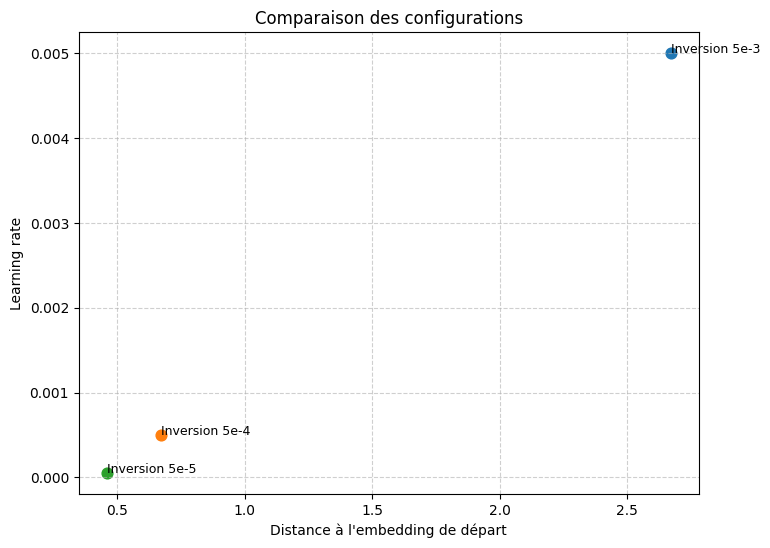
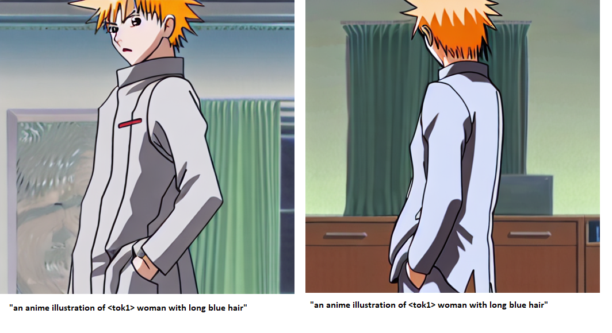
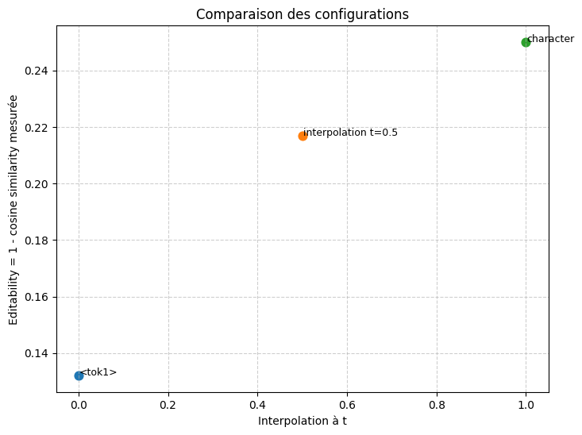
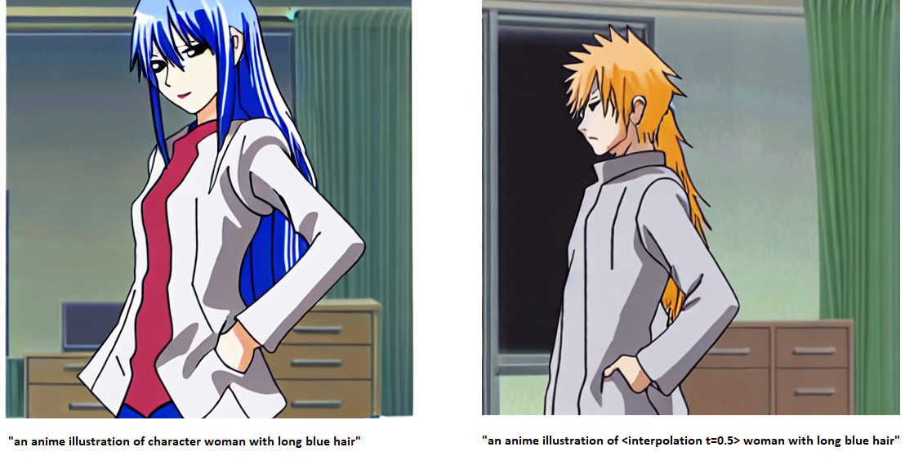
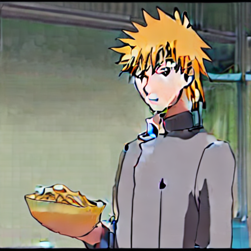

# Structure of the github

This github project was aimed at providing a complete understanding of pivotal tuning for diffusion model so that one could easily understand how to tune hyperparameters depending on what he is looking for.

This github is composed of two main folders :

- Article summaries, which correspond to summaries of papers from the creation of styleGAN to the application of pivotal tuning to diffusion model, along with other paper that can be
useful to make experiment like CLIP Double ellispoid geometry. They are numbered in an specific order so that they can be read one after the other.

- The notebook folder, which contains several notebooks used to train diffusion model, load a config and conduct experiments on it. Many parts of the code was inspired by this repository : . The main differences are that it was simplified to remove advanced options so it focuses on the core concepts of pivotal tuning, and it was commented and reunited in a single notebook si it's more easily understandable and executable.

Next, i will present the different results i have been able to shade light on with reading articles/experiments, which allow for an understanding of pivotal tuning for diffusion model.

# A few words about incoming experiments

For the next experiments, I will summarize what I have gleaned from the articles without justification; for details of the reasoning, see the individual summaries of the articles.

For training config, we take a constant number of steps of 1000 so as not to prolong the training, and we will study the influence of the other parameters.

The images dataset is in the dataset folder, it consists of only 5 images as advised by : https://arxiv.org/pdf/2208.01618.

# Choice of learning rate for inversion

In our case, unlike
styleGAN,
inversion is not free. In fact, by moving away from the starting token, we lose editability, whereas in styleGAN with inversion, we remain permanently in W. Ideally, there should be an initial period where moving away from the starting token 
results in significant gains in reconstruction and little loss in editability, and a second period where the gains in reconstruction are smaller
and the loss in editability is greater. We would then need to reverse at the boundary between these two periods.

We therefore need to measure the evolution of reconstruction and editability as a function of distance from the token, to see at what distance we should reverse. To cover different distances, we use the fact that the distance traveled is approximately nb steps x learning rate, which we can confirm by calculating the Euclidean norm between the token obtained with training and the starting token. We perform the measurements on three learning rates: 5e-3, 5e-4, and 5e-5.

The intersection between the two periods we had predicted is at 5e-4, so we will use this learning rate.

In addition, we can confirm that the token does indeed move away as the learning rate increases: 

Here are some images generated with the three learning rates to visualize the differences:

> LR = 5e-3

> LR = 5e-4

> LR = 5e-5

# Choix du learning rate pour le finetuning

In the styleGAN, they say that they 
apply “light” finetuning, which
allows them to improve reconstruction
without losing editability. We therefore need to define what light fine-tuning is
before we can find the right learning
rate. To do this, we will explain how fine-tuning works in general.

During finetuning, a function learns different concepts. For example, by finetuning our function on a character, the function learns its appearance, but also unwanted elements such as its position and the environment in which it is located. The concepts with the smallest difference between the baseline state and the fine-tuning dataset will be improved first because the function G in the function space will have less distance to travel to improve them. For example, if a character in the dataset contains several different positions, in order to learn these positions, the model will already have to abandon the fact that it produces random positions for the token associated with this character, and in addition, it will only be able to learn a given position when it passes over the image in the dataset with that position. For appearance, the baseline state of the function is already close to the final state thanks to inversion, and each image in the dataset also contributes to improving appearance, so it will be improved much faster than position.

If we want to improve a specific concept such as appearance, we must therefore not move further than the distance that allows us to modify this concept and not the others. This is what the authors of pivotal tuning mean when they talk about light finetuning. 

To find the right finetuning distance, we try different learning rates to find the limit distance where
we start learning the positions, and we stop just before that. We take measurements on two learning rates: 1e-4 and 1e-5.

> LR = 1e-4

> LR = 1e-5

We can see that at 1e-5, only appearance is learned, and then other features such as position and environment are added to the learning process. We
will therefore choose a learning rate of 1e-5.

# 3/ Regularization

## A) Usefulness of regularization in diffusion model

### a.1) Regularization in styleGAN

When fine-tuning $G$ on a latent $w_{p}$, the fine-tuning will affect the nearby latents, this propagation
decreasing with distance. The problem is that we only have one model, so we cannot afford to
lose all of $G$'s face generation capacity just to learn about a single person.
We must therefore avoid this propagation.

To do this, we add a regularization term, which forces $G$ to stick to the base model on latents close to $w_{p}$.
If we take a latent where we regularize $w_{r}$, and we denote the regularization term as $t_{r}$ and the training term as $t_{e}$,
everything will happen as follows:

$$\nabla G(w_{p}) = 0.1 \cdot \nabla(t_{r}) + 0.9 \cdot \nabla(t_{e})$$

$$\nabla G(w_{r}) = 0.1 \cdot \nabla(t_{e}) + 0.9 \cdot \nabla(t_{r})$$

(the coefficients 0.1/0.9 are not exact; they are just to show that, depending on the gradient, one term or the other will be more taken into account).
Thus, the changes in $G$ on $w_{r}$ by $t_{e}$ will be negligible compared to the regularization, and the slowing down of 
the learning of $G$ on $w_{p}$ by $t_{r}$ will be negligible compared to the training term. We can therefore
preserve the faces located around the pivot without slowing down the learning too much.

### a.2) Regularization on styleGAN = regularization on diffusion model ?

To apply regularization to the diffusion model, we work in the embedding space after the CLIP transformer, which is trained to establish a relationship between geometry and semantics, unlike the embedding space after the tokens.
We might then wonder whether regularization applied exactly as in StyleGAN is useful to us.
Actually, it's not, because with LORAs we can easily load/unload a configuration so it is not a problem if learning affect nearby embeddings.

### a.3) Select features learned through regularization

However, regularization can be useful in another way.
During finetuning, the embedding $\langle tok1 \rangle$ will learn all the features of the dataset: appearance, position, environment, etc.
(When I say “the embedding $\langle tok1 \rangle$ will learn,” it's a shortcut for saying that G will change its values on $\langle tok1 \rangle$).
To prevent it from learning useless features, we could add a regularization term that forces $\langle tok1 \rangle$, on the features
we don't want to learn, to remain identical to the version before finetuning.

This way, we would no longer have to limit the distance 
traveled by $G with a small learning rate to avoid learning parasitic features.
We can increase the learning rate so that $G$ covers a larger area of the function space
and find a better reconstruction.

The overfitting limit where the positions and environment were learned was found to be at lr = 1e-4.
Next, we will use this learning rate and see if we can cancel out the learning of positions and environment.

## B) Interpolate between two embeddings

We know that the manifold of text embeddings in CLIP is an ellipsoid
that can be approximated by a sphere, as most coordinates have the same variance.
This sphere is offset from the origin. 
However, this is only true for the last sentence/image token embeddings, which are the ones on which
the CLIP loss is based. We know nothing about the other embeddings. Yet it is these other embeddings that are passed
in matrix form to the diffusion model.

Since character/ $\langle tok1 \rangle$ are in the middle of the sentence at index 5, we can try to see if the embeddings at index 5
of a sentence follow the same distribution in space as the end embeddings. To do this, I took
the same dataset used by the researchers to determine the manifold of end embeddings (MS-COCO 2014),
and I calculated the mean norm and the variance of this norm. In the end, I obtained the same result
as for the end embeddings: norm of 24 and variance of 1. We will therefore be able to perform a vSLERP for our embeddings at position 5, as 
the researchers do on the end embeddings.

However, there is a problem in my code (see Notebooks/manifold_of_text_embeddings.ipynb) because when calculating the mean norm and variance for the end token (I should therefore have the same result as in the article), I get a lower variance with the basic embeddings than with the centered embeddings, which is not consistent with the shift of the text ellipsoid from the origin that the authors showed. I get exactly 27 for the norm and 0.1 for the variance with non centered embeddings. So I will do a SLERP and not a vSLERP until this problem is resolved.

## C) The appearance prompt

Before we can find the term for regularization, we will demonstrate a property.

### c.1) Problem modeling

We begin by modeling our situation mathematically.

We model a prompt/image using two variables, $x$ : appearance, and $y$ : other features, which summarize the information contained in the prompt/image.
In what follows, we consider that the other features are solely the environment, $y$: environment, which does not change the reasoning and allows for better visualization.

The function $G$ is the Unet that transforms a prompt into an image:

$$
G(x_t, y_t) = G_1(x_t),G_2(y_t)
$$

where $G_1$ transforms the text appearance into image appearance and  $G_2$ transforms the text environment into image environment.

Let's take the training prompt: “an anime illustration of $\langle tok1 \rangle$ ".

Initially, the function $G$, which we will annotate as $G_a$, is:  

$$
G_a(\text{“an anime illustration of \<tok1>”}) = G_a(x_t = \langle tok1 \rangle,\, y_t = \langle tok1 \rangle) 
= G_{a1}(\langle tok1 \rangle),G_{a2}(\langle tok1 \rangle) 
= G_{a1}(\langle tok1 \rangle),\text{random}
$$

This is because the appearance and environment information are included in  $\langle tok1 \rangle$.  
In terms of appearance, it resembles our target character thanks to inversion.  
In terms of environment, it is generated randomly because  $\langle tok1 \rangle$ does not contain any information about the environment.

At the end of training:  

$$
G_b(x_t = \langle tok1 \rangle, y_t = \langle tok1 \rangle) 
= G_{b1}(\langle tok1 \rangle),G_{b2}(\langle tok1 \rangle)
$$

We would like:  

$$
G_{b2}(\langle tok1 \rangle) = \text{random}
$$

but this is not the case because the token  $\langle tok1 \rangle$  has been associated with both the appearance **and** the environment of the dataset.

### c.2) Existence of the appearance prompt

We would like to demonstrate that there exists a prompt $(x_t, y_t)$, such that:  

$$
G_b(x_t, y_t) = G_{a1}(\text{char1}),G_{b2}(\langle tok1 \rangle)
$$

where $G_{a1}(\text{char1})$ is a character appearance known by $G_{a}$, with $G_{a1}(\text{char1})  \neq  G_{b1}(\langle tok1 \rangle)$
so it is not affected by the finetuning.

Let's take the prompt, which we will call **appearance prompt**: $\text{“an anime illustration of } \langle tok1 \rangle \text{ woman with long blue hair”}$

We take:  

$$
\text{char1} = \text{“woman with long blue hair”}
$$  

We have :   

$$
G_b(\text{“an anime illustration of } \langle tok1 \rangle \text{ woman with long blue hair”}) = 
\big( p \cdot G_{b1}(\langle tok1 \rangle) + (1-p) G_{b1}(\text{char1}), G_{b2}(\langle tok1 \rangle) \big)
$$  

which can also be written as:  

$$
G_b(\text{“an anime illustration of } \langle tok1 \rangle \text{ woman with long blue hair”}) = 
\big( p \cdot G_{b1}(\langle tok1 \rangle) + (1-p) G_{a1}(\text{char1}),G_{b2}(\langle tok1 \rangle) \big)
$$  

since $G$ does not change its values on $char1$ with training.

The model constructs the appearance with a percentage taken from  $\langle tok1 \rangle\$ and a percentage taken from   $char1$

If we could get $p = 0$, the prompt would satisfy the property.  By testing this prompt on the model trained at $10^{-4}$,  we see that, on the contrary, we have $p = 1$.

To reduce this percentage, we can try to increase editability by interpolating between $\langle tok1 \rangle$ and character.
In fact, fine-tuning causes a loss in $\langle tok1 \rangle$ editability, and this loss decreases with distance. However, the effect
of fine-tuning decreases with distance, so we must ensure that even with distance, we still have:

$$
G_{b2}(interpolation) = G_{b2}(\langle tok1 \rangle\)
$$

We will therefore interpolate between $\langle tok1 \rangle\$  and character, measure the influence of finetuning and editability,
and choose an optimal point. To measure the influence of fine-tuning, we calculate the cosine similarity
of the generated images with those in the dataset. To measure editability, we generate images using the simple prompt and the appearance prompt from the interpolated point
and calculate the cosine
similarity between the two. The decrease in similarity in this case will be due to the inclusion
of the appearance terms in the appearance prompt.
Since we plan to regularize finetuning at 1e-4, we perform these measurements on the model fine-tuned
at 1e-4.

### c.3) Interpolation results

We have these evolutions of the influence of fine-tuning and editability with interpolation.

The influence decreases linearly while editability increases logarithmically. It would therefore be beneficial to take the interpolation at t = 0.5,
which gives us the best compromise between editability and the influence of fine-tuning.
However, when analyzing the images generated by the interpolations, we realize that the evolution of editability does not accurately represent the extent to which
appearance terms take precedence over $\langle tok1 \rangle$. In fact, appearance terms seem to be taken into account much more at t = 1,
which is not highlighted by the curve.

One explanation is that by moving away from $\langle tok1 \rangle$, the generator avoids overfitting and generates more random images. 

Thus, editability will decrease significantly between t= 0 and 
t = 0.5 because the cosine similarity will be decreased by the randomness of instance, even if the appearance is only slightly modified by the appearance prompt. To verify this, we change the measure of editability. We calculate the cosine similarity
between images generated with the same prompt, and we compare it with the cosine similarity of images generated with the simple prompt and the appearance prompt.
By calculating the difference between these two cosine similarities, we should be able to
quantify only the evolution of the consideration of appearance in the generation, without being confused by the increase in randomness.

Ultimately, the evolution of editability is still not representative of the consideration of appearance terms. I therefore decided to follow my observation
and regularize at t = 1, where we see that appearance is indeed modified and that other features such as environment and positions remain influenced by
fine-tuning, even though I am unable to
find a formula to substantiate this observation.

## D) The regularization term

### d.1) Finding the regularization term

The two previous points allowed us to find a prompt $(x_t,y_t)$ where 

$G_{b1}(x_t) = G_{a1}(\text{char1})$ and $G_{b2}(y_t) = G_{b2}(\langle tok1 \rangle)$ with $G_{a1}(\text{char1}) \neq G_{b1}(\langle tok1 \rangle)$.

We denote $G_e$ as the function $G$ trained from $G_a$ to $G_b$.  

On the prompt appearance:

- $G_{e1}(x_t) = G_{e1}(\text{char1})$ because the editability of $G_e$ is greater than that of $G_b$,  then $G_{e1}(\text{char1}) = G_{a1}(\text{char1})$ because
$G_{a1}(\text{char1})$ is not affected by the finetuning.

- $G_{e2}(y_t) = G_{e2}(\langle tok1 \rangle)$, because only $\langle tok1 \rangle$ contains environmental information.

We will modify the loss by adding a second term relating to the appearance prompt:

$$
\text{Loss} = \| G_e(\text{“an anime illustration of }\langle tok1 \rangle\text{"}) - \text{dataset} \|
+
 \| G_e(\text{“an anime illustration of character woman with long blue hair”}) - G_a(\text{“an anime illustration of character woman with long blue hair”}) \|
$$

Let's break down the second term:  

$$
\| G_e(\text{“an anime illustration of character woman with long blue hair”}) - G_a(\text{“an anime illustration of character woman with long blue hair”}) \|
$$

Expanding:  

$$
= \| G_{a1}(\text{char1}),G_{b2}(\langle tok1 \rangle) - (G_{a1}(\text{char1}),\text{random}) \|
$$

$$
= \| 0,G_{b2}(\langle tok1 \rangle) - \text{random} \|
$$

Thus, the first term of the loss pushes $G$ to resemble the dataset on $\langle tok1 \rangle$, and the second term forces $\langle tok1 \rangle$ not to store environmental information.

That said, there are still two problems. 
First, by learning the dataset environment, the first term decreases, and by keeping the original environment,
the second term decreases. So we don't know how the model will evolve to decrease the loss because the two possibilities are equivalent.
We will therefore weight the second term by a coefficient, such as *2, so that keeping the initial environment
decreases the loss more than learning the dataset environment.

The second problem is that in the term $\| 0,G_{b2}(\langle tok1 \rangle) - \text{random} \|$, we do not know if learning the dataset environment will actually increase the term.
In fact, the base model generates a random environment, so comparing two generations of random environments potentially gives as much error 
as comparing a fixed environment (the one learned from the dataset) with random environments.

For now, we will set aside problem 2 by setting an environment in the regularization prompt: "an anime illustration of character woman with long blue
hair in a garden,“ and we will see if the term $\| 0,G_{b2}(\langle tok1 \rangle) - G_{a2}(garden) \|$ actually allows us to learn the environment ”a garden" rather than the one from
the dataset.

### d.2) Regularization results

Unfortunately the above method did not prevent overfitting at lr =  1e-4, we do not see the garden as an environment. 

For improvement, we could try increasing the coefficient, like from 2 to 10, among other things that are for now left for future work.

