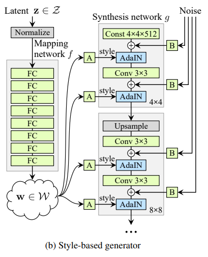
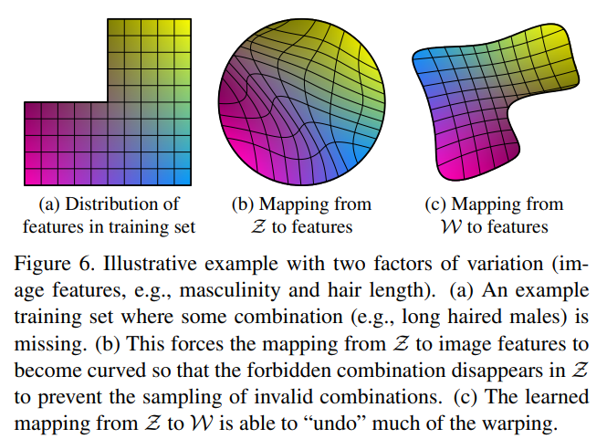

# StyleGAN and the latent space W

Prerequisite: understanding what a GAN is

Original article: https://arxiv.org/pdf/1812.04948

## StyleGAN: a GAN where the generator is modified.

Instead of feeding the generator with the vector z taken from space Z (e.g., R512),
we feed it with a constant vector learned during training, and the vector z is injected after each convolution
into the generator. This allows the generator to extract the information it needs at each step
instead of having to remember everything from the beginning. Between each convolution, a noise vector is also added, 
which provides the generator with a basis for constructing randomness at each stage (for example,
to construct hair). Without this, it would have to find a way to construct randomness itself using 
its weights, which would reduce the other reconstruction capabilities.

## The latent space W

In this section, we use a styleGAN trained on faces as an example.

Ideally, we would like the Z space to be disentangled: this means that for each
image variation factor (e.g., face rotation), we can find a linear subspace in Z whose directions
control the modification of this variation factor (e.g., a direction for rotation around each axis).
The intuition for understanding that this disentangled space can exist is that different variation factors (
hair, aging) modify attributes that are common to them (hair color is shared between aging
and hair), so to create a subspace, we need to find the directions that modify the attributes according to
our variation factor.

Let's analyze Z to see if the space is disentangled. Z can be represented as a hypersphere with a radius of sqrt(512) from R512, in which
the majority of vectors will be drawn from the normal distribution. With training on this sphere, the generator will take
values that are close to those in the dataset. Now suppose that a variation factor has a value range that is absent from the dataset.
For example, suppose that in the dataset it takes values from [0,1] and then from [2,+oo].
If we can represent this variation factor with a subspace in Z, we can take a direction in this space on which
moving G will cause the variation factor to vary continuously. We can therefore find a portion of a line in the hypersphere where G will take values for the variation factor that are impossible [1,2]. Thus, the variation factors cannot
be represented by subspaces in Z, the space is entangled. 

This problem is solved by creating a latent space after Z: f(Z) = W.
The latent space solves the problem because it does not have the spatial constraint of Z that vectors in the hypersphere give images close
to the dataset. It can therefore freely choose the values that G takes on each area of the space. With optimization, we can then approximate the representation of the variation factors by linear subspaces.

The article uses this diagram to depict the problem:

