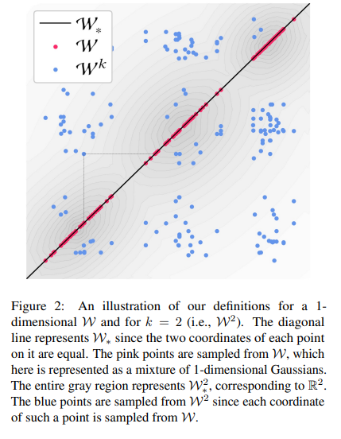
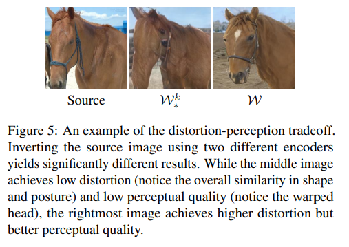
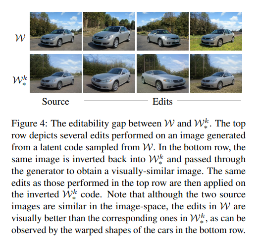
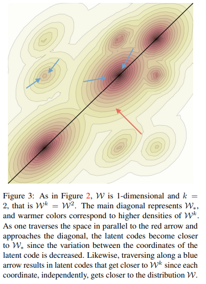

# Image editing with styleGAN

Article: https://arxiv.org/pdf/2102.02766

To modify an image, we can take advantage of the representation of variation factors in linear subspaces in W. We take an image, invert it in the latent space W, move into the linear subspace of a variation factor, then apply G to our new latent and retrieve our modified image. This method works, but it poses several problems.

## The inversion problem

Inverting an image in W gives with optimization a latent w, but reconstructing the image with G(w) does not perfectly reproduce the image. To evaluate a reconstruction, two measures are introduced: distortion and perceptual quality. Distortion corresponds to the distance between two images measured using a norm on the image space. Perceptual quality refers to how realistic an image is.
The idea is that one image may look aesthetically similar to another, but have no real meaning. 

Since inversion in W is not always convincing, we propose improving it by enlarging the starting space on which optimization is performed. This can be done in different ways: take k latent vectors in W (one per layer of the generator) instead of one, take a vector in 
W* = R512 in which W is included, take k vectors in W*k. A graph in the article illustrates how these different spaces are organized.

Note: Why would taking k vectors in W instead of one work when we trained the generator to use
only one vector?

The generator at each layer extracts different information from a vector w: for the deeper layers,
global information; for the surface layers, more precise information. So for a given image,
perhaps a vector w can provide the exact information for the global information but cannot 
perfectly reproduce the precise information, and vice versa, hence the possibility of several vectors delivering a better image
than only one.

## The compromise between distortion/perceptual quality and editability  

We are now able to perform more accurate reconstructions by inverting in larger spaces, but this comes at a cost. First, there is a loss of perceptual quality. While the images have better distortion, they are less meaningful than those inverted in W, as can be seen in this example between an image inverted in W and in W*k.

In addition, there is also a loss in editability. Modifications made to inverted images in W produce better results than those inverted in W*k, as can be seen in this image.

In fact, there is a trade-off between distortion and perceptual quality + editability. The further we move away from the W space, the more distortion we gain, but at the expense of the other two characteristics. This is because it is on W that the generator has been trained to produce meaningful images.

To evaluate the distance of a vector from W*k to W, two criteria are used. The first is the distance from W*k to W*, which 
corresponds to the variation between the vectors of W*k: the closer the vectors are to each other, the closer 
we can consider ourselves to be to W*. The second criterion is the distance from W*k to Wk, which corresponds to the individual distance
of the k vectors from W* to W. By minimizing these two criteria, a vector from W*k approaches W.

This graph from the article repeats the previous representation of W*k and introduces two arrow colors for the two ways of approaching W: the red arrow to decrease the variation between vectors, and the blue arrow to bring the individual vectors closer to those of W.

