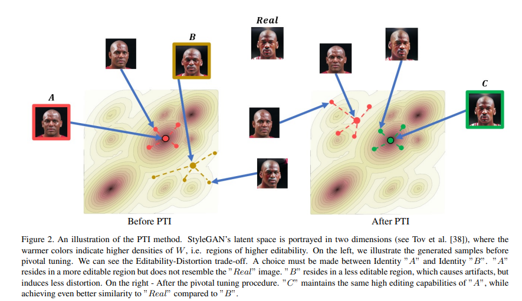
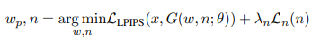
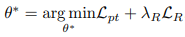
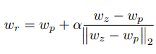
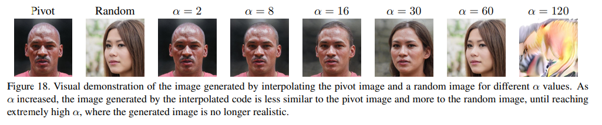
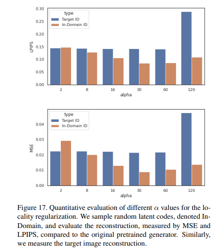

# Break free from the distortion/perceptual quality + editability constraint

Article: https://arxiv.org/pdf/2106.05744

When you invert an image in W, you preserve the perceptual quality + editability, and even if the distortion
is higher than in W*k, the generated image remains close to the original image. We can therefore try to fine-tune
the generator so that at this point w, we obtain exactly the original image, which should be possible
without modifying the semantics of the W space, but only by changing the appearance of the latents close to w.
The point w is called the pivot.
This is illustrated in this graph from the article, where we can see that the space where W is dense has retained its semantics
(changing direction changes the orientation of the face), and the appearance of G in this space has changed slightly
to resemble the original image.

## Inversion

We take a latent w in W and a noise n through optimization to produce an image close to the target.

Here, noise is an integral part of the inputs because it defines the random patterns at several stages of synthesis,
for example, the overall shape of the hair at the first layer of synthesis, and then the more precise patterns of the 
strands at the last layer. This noise must therefore also be optimized to get as close as possible to the desired image. 
The loss thus consists of two terms: a term for the difference between the generated image and the target image, and a 
term for noise regularization, which ensures that the noise parameters are decorrelated and only store 
random values, and not semantic information, which is reserved for w.

## Tuning

For tuning, we have a term for the difference between the target image and the image generated with the latent, and a
regularization term that aims to force the tuning to remain local around w.

For the regularization term, we draw a vector in Z, transform it into latent wz, and perform an interpolation between
wp (the pivot) and wz, whose distance from wp is measured by an alpha coefficient.

The idea behind this interpolation is that if wz is too far from wp, the effect of fine-tuning will be weak on wz, so the regularization term
will have little effect, and conversely, if it is too close to wp, the main term of the loss will force fine-tuning of the point and regularization will be weak. It is therefore necessary to find a point at the right distance. By testing several alphas, the researchers found that
an alpha of 60 gave an image almost identical to wz, and that an alpha of 30 gave a good compromise between wz and wp.

Reconstruction tests show that the loss between images generated for wz by the new and old generators is lower
in the alpha 30 case.

