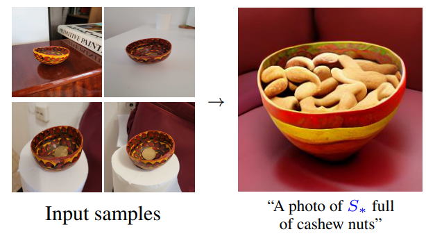
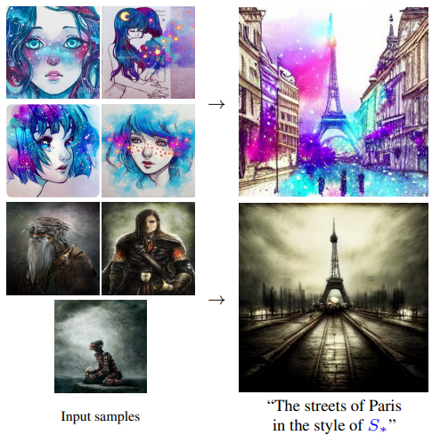
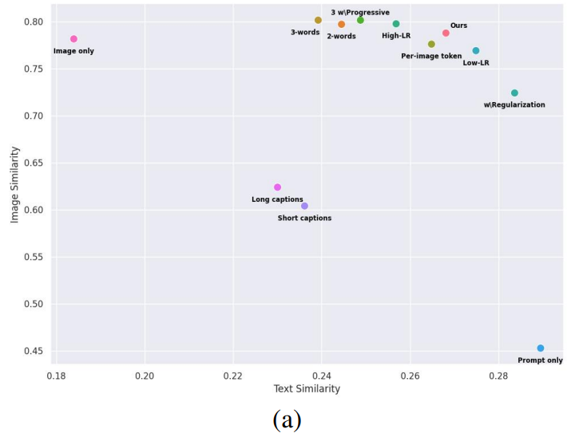
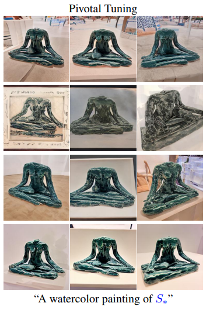
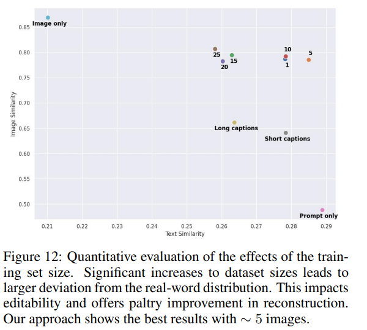

# A/ Modifying an image using a diffusion model

Article: https://arxiv.org/pdf/2208.01618

In a diffusion model, the image is generated from a prompt, whereas with a GAN, we start from a latent w. To modify an image in the diffusion model, we modify the words
in the prompt, whereas in the GAN, we move in specific directions in W.
This comparison allows us to understand how to modify an image in a diffusion model by drawing inspiration from the method used for GANs. 
We create one or more tokens (we choose how many tokens we want to represent our image) and optimize their embeddings to obtain the best reconstruction.
Then we place these tokens in different prompts to modify the image.

To initialize the embeddings of these tokens, we can choose as the starting value the embedding of the class to which our concept belongs (for example, if it is an animal,
we can take the embedding of the token lion, tiger, etc.). We choose a prompt such as “a photo of s\*1 s\*2 s\*3 etc.” to generate the images during training.

In the article, the authors explored this inversion method from different angles to see its capabilities and limitations.

# B/ Capabilities:

## a) Semantic understanding

Even though the model is trained to represent the image of the object as a whole and not its interaction with the environment, it semantically understands
its composition and can make it interact with other objects. For example, if we teach it about a specific bowl, it will be able to contain
objects inside it, just like any other bowl.

## b) Abstract ideas

The model is not limited to learning about concrete objects, but can also grasp abstract ideas such as
a drawing style with this type of prompt: “A painting in the style of s\*”

# C/ Limitations:

## a) Interaction between new objects

Since objects are learned using a set of images in which they are at the center of the scene, the model has difficulty making them
interact with each other (it can make them interact with concepts it already knows, as we have seen, but it is the interaction between new concepts that
poses a problem). It is possible that training them to interact
with other new objects rather than being at the center of the scene could resolve this issue.

# D/ Evaluation of the method:

The inversion method can be varied by changing certain hyperparameters: learning rate, loss formula, number of tokens, etc.
Changing these hyperparameters does not alter the capabilities/limitations we saw earlier, which are specific to the method.
However, within the scope of these capabilities/limitations, they can improve reconstruction and editability if chosen wisely.
Methods are therefore needed to evaluate these two criteria in order to select the best hyperparameters.

## a) Reconstruction

We want to evaluate whether the generated concept resembles the concept in the dataset.
We generate 64 images, encode them and the images in the dataset in the CLIP embedding space, calculate
the cosine similarity of all generated image/dataset image pairs, and take the average.

## b) Editability

We want to evaluate how editable the learned concept is. To do this, we create prompts with variations
in environment, style, and interaction with other objects. For each prompt, we generate 64 images, calculate the
average vector in the CLIP embedding space, and calculate its cosine similarity with the prompt used
for generation, from which we have removed the new token “a photo of S\* on the moon” -> “a photo of on the moon.”

# E/ Choice of hyper-parameters

The authors of the article have analyzed the impact of different hyper-parameters on reconstruction and editability using the above methods,
which gives an idea of what to change according to our objective.

## a) Basic implementation

The implementation was done on a model which preceded stable diffusion, so the parameters may
not be exactly the same in our case, but they still give an idea of the starting point:

- For the embedding of the new word, we take as starting vector the vector of the class to which our object is attached
(e.g. cat, man, tree ...)
- 5 images in dataset
- 0.005 LR
- 4 batch-size
- 5000 steps

## b) Shift on the editability/distortion curve

The authors observed the existence of an editability/reconstruction curve, and the further the vector(s) taken in the embedding space
move away from the initial embedding of the class (e.g., lion, tiger, etc.), the more reconstruction is gained while losing editability. 

In this graph, an increase in image similarity indicates better reconstruction, and an increase in text similarity indicates better editability (in line with
the two evaluation methods seen previously). There is therefore a curve at the top right on which the different configurations are positioned, with each configuration favoring reconstruction/editability to a greater or lesser extent than the others.

This tradeoff is the same as we observed
with styleGANs: when the latent(s) moved away from the W space where the generator had been trained, we gained in reconstruction and lost in editability.

Ultimately, varying the hyperparameters will move the new tokens further or closer to the initial embedding, so they must be chosen according to where we want to be on the curve: either we want to favor reconstruction or editability.

### b.1) Improving editability

To improve editability, we need to get closer to the initial embedding. 

#### b.1.1) Decreasing the learning rate

With a lower learning rate, we stray less from the initial embedding with the same number of steps. This is the “Low LR” point on the graph.

#### b.1.2) Regularization

An L2 norm between the new embedding and the embedding of the object class can be introduced into the loss, so that optimization favors changing the
direction of the new embedding rather than its distance from the initial embedding. This is the “W/Regularization” point on the graph.

### b.2) Improve reconstruction

#### b.2.1) Increase the learning rate

Increasing the learning rate improves reconstruction for the same reasons that decreasing it improves editability. This is the “High LR” point on the graph.

#### b.2.2) Increase the number of tokens learned

We can choose to learn several embeddings instead of one, or even learn a common embedding
for all images and a different one so that the model concentrates the common information
in the shared embedding and the specific embeddings retrieve the information specific to each image
that is not useful to us. These methods are similar to those used in styleGAN when we chose to invert in W\*k instead of W\* to obtain a better reconstruction.
In the same way, they move the new tokens further away from the initial embedding by multiplying the vectors.

However, compared to the single token, these methods provide a very slight gain in
reconstruction, if any, and a much greater loss in editability. This can be seen in the graph with the “3-words,” “2-words,” and “Per-image token” configurations
compared to “Ours”.

Ultimately, adjusting the learning rate is the simplest method for moving along the curve.

## c) S'affranchir de la courbe editability/reconstruction : le pivotal tuning

Dans le styleGAN pour s'affranchir de la limite imposée par la courbe, on découpe l'inversion en deux étapes.
On inverse l'image dans W pour avoir une bonne editability, et ensuite on finetune le générateur afin de modifier
les valeurs prises localement près de w. Ainsi on obtient une bonne reconstruction en profitant de l'editability
des points de W. Pour le modèle de diffusion, on peut appliquer cette même méthode en finetunant l'unet (on ne finetune pas aussi le text encoder car on ne veut pas
modifier la sémantique dans l'espace des embeddings mais seulement modifier l'apparence de certains embeddings ce qui est géré par l'unet).
Toutefois, les auteurs de l'article ont observé  qu'appliquer cette méthode dans le cas du modèle de diffusion n'est pas aussi efficace et fait perdre l'editability qui aura du être préservée par le finetuning. Ils proposent des idées pour modifier ce finetuning, mais qu'ils n'ont pas encore exploré.

Ces images correspondent à la génération d'un prompt étant censé placée la sculpture dans un tableau, avec à chaque fois un guidance scale s (paramètre qui influe sur a quel point
l'unet va prendre en compte le prompt pour générer l'image) plus élevé : 1,2 et 5. Au final le modèle est incapable de placer la statue dans un tableau donc on a perdu en editability.

## d) Augmenter le nombre d'images dans le dataset

Le nombre d'image affecte peu la reconstruction, un nombre optimal de 5 est trouvé pour l'editability.

