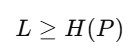

# Code
On veut communiquer n symboles observés. Pour cela on a besoin d'un code pour chaque symbole. Un code est une suite de chiffre binaires 0 ou 1. Par exemple si on prend deux symboles A et B, on peut coder A par 0 et B par 1.

Pour communiquer les differents symboles, les codes de chaque symbole sont envoyés les uns a la suite des autres. On ne peut donc pas coder les symboles n'importe comment, sinon le code sera indécodable. Par exemple si on code un symbole C avec 01, alors 01 peut être décodé à la fois en AB et en C. On appelera un code décodable un code qui peut être décodé de façon unique. 

Dans les codes décodables, il existe un code particulier appelé code préfixe. Un code est préfixe si aucun code n'est le préfixe d'un autre. Par exemple dans notre cas avec A, B et C, le code n'était pas préfixe car A (0) est préfixe de C(01).

# Entropie

On a un ensemble de n symboles qu'on observe et souhaite communiquer. Chaque symbole ni à la probabilité pi
d'apparaître. On veut créer un code de manière à pouvoir communiquer ces n symboles, de sorte que les séquences
utilisées pour coder les symboles les plus fréquents soient les plus petites (on diminue ainsi le coût en calcul
avec moins de bits traités). Il y a certaines propriétés qu'un code doit vérifier pour être décodable, on ne va
pas détailler lesquelles ici et on parlera juste de "code" en général sans entrer dans ces détails.

# Théorème 1 

Pour tout code, la longueur moyenne (somme des longueurs des séquences pour ni pondérées par pi)
a une borne inférieure appelée entropie.

# Théorème 2

Tout code peut être transformée en code préfixe (un code préfixe est un code ou aucune séquence est le préfixe
d'une autre séquence) sans augmenter la longueur moyenne

# Théorème 3 : Kraft-Millman

Si les longueurs des séquences li vérifient cette inégalité, il existe un code préfixe avec de tels longueurs
pour coder les n symboles. 

# Théorème 4 

Pour toute distribution de probabilité sur n, prendre pour ni une séquence de longueur li = log2(qi) vérifie
le théorème de Kraft-Millman et est donc un code valide.

# Théorème 5

En utilisant la distribution originale pour les longueurs, c'est-à-dire li = log2(pi), on obtient la longueur
minimale pour un code qui est l'entropie.

# Exemple de code optimal pour un ensemble de 4 symboles 

