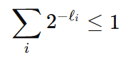
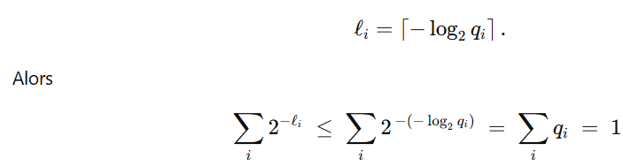
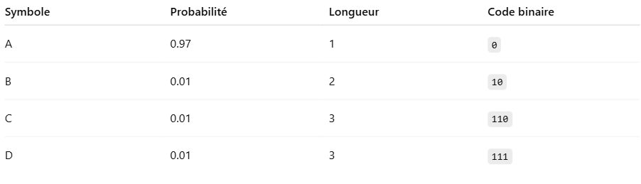

# Code
On veut communiquer n symboles observés. Pour cela on a besoin d'un code pour chaque symbole. Un code est une suite de chiffre binaires 0 ou 1. Par exemple si on prend deux symboles A et B, on peut coder A par 0 et B par 1.

Pour communiquer les differents symboles, les codes de chaque symbole sont envoyés les uns a la suite des autres. On ne peut donc pas coder les symboles n'importe comment, sinon le code sera indécodable. Par exemple si on code un symbole C avec 01, alors 01 peut être décodé à la fois en AB et en C. On appelera un code décodable un code qui peut être décodé de façon unique. 

Dans les codes décodables, il existe un code particulier appelé code préfixe. Un code est préfixe si aucun code n'est le préfixe d'un autre. Par exemple dans notre cas avec A, B et C, le code n'était pas préfixe car A (0) est préfixe de C(01).

# Entropie

On suppose maintenant que les symboles ont des probabilités d'apparition différentes, un symbole ni à ainsi une probabilité pi d'apparaître. On veut créer un code de sorte que les séquences
utilisées pour coder les symboles les plus fréquents soient les plus petites, afin d'avoir une transmission moins coûteuse. Cela revient a minimiser l'espérance de la longueur d'une séquence.

# Théorème 1

Tout code décodable peut être transformée en code préfixe sans augmenter la longueur moyenne. Ainsi, pour résoudre notre problème, il suffit de trouver le minimum de l'espérance sur les codes préfixes seulement.

# Théorème 2 : Kraft-Millman

Si les longueurs des séquences li vérifient cette inégalité, il existe un code préfixe avec de tels longueurs
pour coder les n symboles. 

# Théorème 3 

Pour toute distribution de probabilité sur n, prendre pour ni une séquence de longueur li = log2(qi) vérifie
le théorème de Kraft-Millman et est donc un code valide.

# Théorème 5

En utilisant la distribution originale pour les longueurs, c'est-à-dire li = log2(pi), on obtient la longueur
minimale pour un code qui est l'entropie.

# Exemple de code optimal pour un ensemble de 4 symboles 

