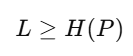
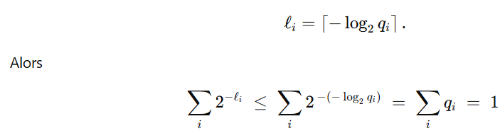

# Entropy

We have a set of n symbols that we observe and wish to communicate. Each symbol has a probability pi
of appearing. We want to create a code so that we can communicate these n symbols, such that the sequences
used to encode the most frequent symbols are the smallest (thus reducing the computational cost
with fewer bits processed). There are certain properties that a code must verify in order to be decodable, but we will not
detail them here and will just talk about “code” in general.

# Theorem 1

For any code, the average length (sum of the lengths of the sequences weighted by pi)
has a lower bound called entropy.

# Theorem 2

Any code can be transformed into a prefix code (a prefix code is a code in which no sequence is the prefix
of another sequence) without increasing the average length

# Theorem 3: Kraft-Millman

If the lengths of the sequences li satisfy this inequality, there exists a prefix code with such lengths
to encode the n symbols. 

# Theorem 4

For any probability distribution on n, taking for ni a sequence of length li = log2(qi) satisfies
the Kraft-Millman theorem and is therefore a valid code.

# Theorem 5

Using the original distribution for lengths, i.e., li = log2(pi), we obtain the minimum length for a code, which is entropy.

# Example of an optimal code for a set of 4 symbols

