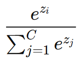
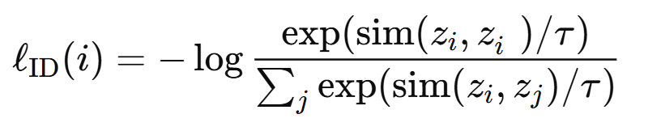
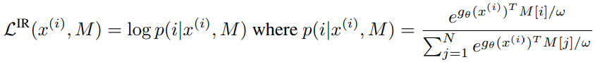
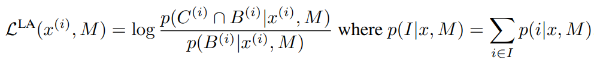
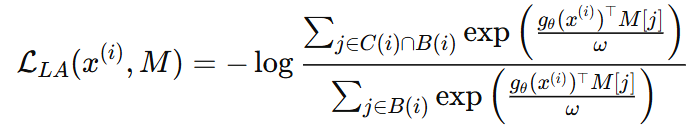
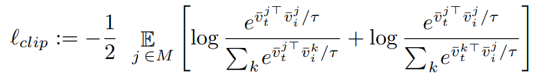
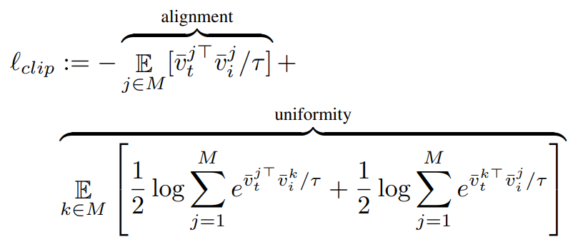

Articles : https://arxiv.org/pdf/2005.13149 , https://arxiv.org/pdf/2411.14517

# Representation learning supervisé :

On veut apprendre à associer des images à une classe, sachant que les images du dataset sont labellisées et qu'on 
connait l'ensemble des classes possibles. On modélise ce problème par une distribution de probabilité g(x). Pour
x une image, g(x) donne les probabilités que x appartienne à chacune des classes. La bonne distribution de g(x)
est 1 pour la classe à laquelle x appartient et 0 pour les autres. Pour approcher le modèle gtheta de la bonne
distribution g, on utilise pour loss l'entropie qui est une distance entre g et gtheta. 

Pour construire g(x) à partir d'une image x, on créé C embeddings zi, un pour chaque classe, et on fait le softmax
entre ces embeddings pour retrouver une distribution de probabilités. Par exemple, la probabilité que x appartienne
à la classe i est : 

# Representation learning non supervisé : instance discrimination

Les images ne sont pas labellisées donc on ne peut pas entrainer le modèle a assigner les images à leur classe.
Pour reconnaître les images, on va les placer dans un espace latent où elles seront séparées (je n'ai 
pas lu l'utilité de cette séparation pour l'instant qui n'est pas aussi évidente que donner la classe d'une image).
On modélise ce problème en imaginant que chaque image a sa propre classe. g(x) a donc autant
d'évènements élémentaires qu'il y a d'images dans le dataset.

Pour construire g(x) à partir d'une image x, on construit un seul embedding zi pour chaque image du dataset 
(au lieu de C
précédemment), et on fait le softmax d'un embedding sur tous les autres pour retrouver la distribution de probabilité.
La loss qui est l'entropie correspond au softmax de la norme de z (z=g(x)) sur le produit scalaire de z avec les autres
embeddings zi. Le numérateur ne peut pas être amélioré, mais le dénominateur peut être diminué en éloignant z des 
autres zi, ce qui permet de repousser les embeddings dans l'espace latent.

L'entrainement doit être simplifié car en l'état, il suppose que l'on recalcule les embeddings de toutes les images
à chaque étape, et également calcule la somme des exponentielles de tous les embeddings. Les simplifications sont
décrites dans l'article et pour l'instant je n'ai pas lu les justifications. En résumé ils stockent les embeddings
dans une banque M pour ne pas recalculer gtheta(xi) à chaque étape, et réduisent le dénominateur du softmax de N
à K<<N tirer uniformément dans N, certainement parce que beaucoup de termes ont une contribution proche de zero.

# Representation learning non-supervisé : local aggregation

On aimerait maintenant regrouper les images qui font partie d'une même classe entre elles, et pas avoir une
classe pour une image ce qui éloigne inutilement des images similaires.
Comme on ne connaît pas à l'avance les classes, on fait un clustering sur le dataset.
Il y a alors deux mesures de similarité sur l'espace : la distance géométrique et le clustering.
Là où auparavant on avait juste à améliorer la distance géométrique entre les embeddings, ici il faut en plus
prendre en compte le clustering. On améliore ces mesures conjointement en deux étapes :
- on rapproche les vecteurs qui sont proches géométriquement et dans un même cluster
- pour un vecteur dans le cluster et loin géométriquement, ou un vecteur hors du cluster et proche géométriquement :
on éloigne géométriquement ce vecteur du vecteur cible. On pourrait faire l'inverse et le rapprocher dans les deux
cas, mais cela amènerait à renforcer le cluster de départ qui est aléatoire comme la fonction n'est pas entrainée.
Au contraire on veut déplacer au maximum les vecteurs et faire varier le cluster avec l'entrainement.

La fonction g(x) est la même que précédemment, mais la loss est différente.
La loss cherche à maximiser la probabilité que x appartienne à la même classe que les éléments de son cluster parmi 
les voisins proches (là où avant elle permettait juste de maximiser la probabilité que x appartienne à sa propre
classe). Cela veut dire que parmi les voisins proches, les éléments du cluster vont se rapprocher de 
x, et comme on utilise un softmax, les éléments hors du cluster vont s'en éloigner. Toutefois cette loss ne traite
pas le cas où un élément est dans le cluster mais n'est pas un voisin proche de x. Dans ce cas, il va être un 
voisin proche d'un autre embedding et se faire déplacer par sa loss.

# Loss NT-Xent :

C'est la loss utilisée sur CLIP, qui est bimodale contrairement aux loss précédentes car on a les embeddings d'image
et de texte. Elle fonctionne sur le principe de l'instance discrimination : il y a une classe pour tous les textes et
images. Pour une paire texte-image, on veut maximiser la probabilité que l'image appartienne à la classe de son
texte, et que le texte appartienne à la classe de son image. On se retrouve donc avec deux loss au lieu d'une
quand on avait qu'une seule modalité. 

La loss complète maximise ces deux probabilités pour l'ensemble des pairs d'un batch. Maximiser différentes
probabilités en même temps permet de ne pas éloigner les vecteurs les uns des autres au hasard comme cela se
passerait si on maximisait la proba d'une seule paire. Là chaque vecteur s'éloigne les uns des autres en prenant
en compte le fait qu'il ne doit pas s'approcher d'une autre paire.

Cette loss n'est pas écrite comme dans l'article mais elle vaut exactement la même chose, elle montre cependant plus
explicitement la maximisation des deux probabilités pour chaque modalité. Pour s'en convaincre il suffit de faire
le changement de varibale j=k sur la deuxème espérance de cette formule.

