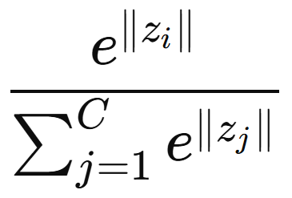
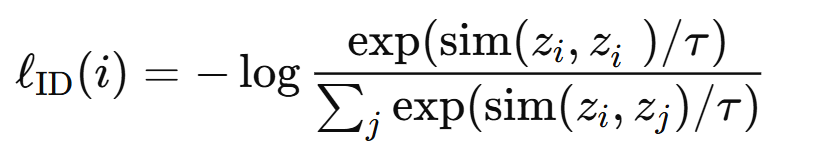
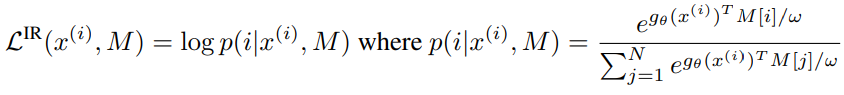
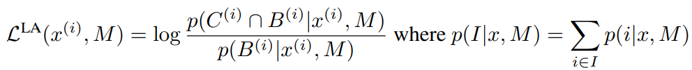
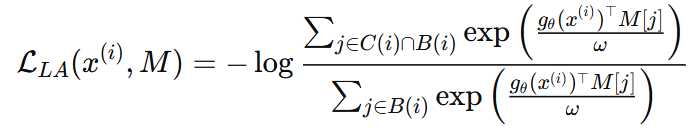
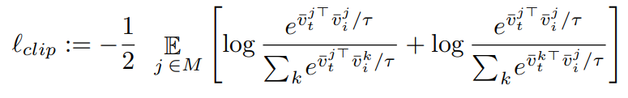

Articles : https://arxiv.org/pdf/2005.13149 , https://arxiv.org/pdf/2411.14517

# Supervised representation learning:

We want to associate images with a class, given that the images in the dataset are labeled and that we 
know all the possible classes. We model this problem using a probability distribution g(x). For
x an image, g(x) gives the probabilities that x belongs to each of the classes. The correct distribution of g(x)
is 1 for the class to which x belongs and 0 for the others. To get the model gtheta closer to g, we use entropy for loss, which gives a distance between g and gtheta. 

To construct g(x) from an image x, we create C embeddings zi, one for each class, and perform softmax
between these embeddings to find a probability distribution. For example, the probability that x belongs
to class i is: 

# Unsupervised representation learning: instance discrimination

This time the images are not labeled, so we cannot train the model to assign images to their class.
We choose to assign a class to each image in the dataset, and the goal will be for the model to assign each image to its own class. 
g(x) therefore has as many elementary events as there are images in the dataset. 
I have not yet looked into the usefulness of this type of model, which is not as obvious as the previous one.

To construct g(x) from an image x, we construct a single embedding zi for each image in the dataset 
(instead of C) and
the entropy (which is -log p where p is the probability that x belongs to its own class) is : 

The numerator cannot be improved, but the denominator can be reduced by moving z away from the 
other zi, which allows the embeddings to be pushed back into the latent space.

Training needs to be simplified because, as it stands, it requires recalculating the embeddings of all images
at each stage, as well as calculating the sum of the exponentials of all embeddings. The simplifications are
described in the article, but I haven't read the justifications yet. In summary, they store the embeddings
in a bank M so they do not have to recalculate gtheta(xi) at each step, and reduce the denominator of the softmax from N
to K<<N drawn uniformly from N, probably because many terms have a contribution close to zero.

# Representation learning non-supervisé : local aggregation

On aimerait maintenant regrouper les images qui font partie d'une même classe entre elles, et pas avoir une
classe pour une image ce qui éloigne inutilement des images similaires.
Comme on ne connaît pas à l'avance les classes, on fait un clustering sur le dataset.
Il y a alors deux mesures de similarité sur l'espace : la distance géométrique et le clustering.
Là où auparavant on avait juste à améliorer la distance géométrique entre les embeddings, ici il faut en plus
prendre en compte le clustering. On améliore ces mesures conjointement en deux étapes :
- on rapproche les vecteurs qui sont proches géométriquement et dans un même cluster
- pour un vecteur dans le cluster et loin géométriquement, ou un vecteur hors du cluster et proche géométriquement :
on éloigne géométriquement ce vecteur du vecteur cible. On pourrait faire l'inverse et le rapprocher dans les deux
cas, mais cela amènerait à renforcer le cluster de départ qui est aléatoire comme la fonction n'est pas entrainée.
Au contraire on veut déplacer au maximum les vecteurs et faire varier le cluster avec l'entrainement.

# Unsupervised representation learning: local aggregation

We would now like to group images that belong to the same real class together, rather than having one
class for one image, which unnecessarily separates similar images.
Since we do not know the classes in advance, we perform clustering on the dataset.
There are then two measures of similarity in the space: geometric distance and clustering.
Whereas previously we only had to improve the geometric distance between embeddings, here we also have to
take clustering into account. We improve these measures jointly in two steps:
- we bring together vectors that are geometrically close and in the same cluster
- for a vector in the cluster that is geometrically distant, or a vector outside the cluster that is geometrically close:
we move this vector geometrically away from the target vector. We could do the opposite and bring it closer in both
cases, but this would reinforce the initial cluster, which is random as the function is not trained.
On the contrary, we want to move the vectors as much as possible and vary the cluster with training.

The function g(x) is the same as before, but the loss is different.
The loss seeks to maximize the probability that x belongs to the same class as the elements in its cluster among 
its close neighbors (whereas before it just maximized the probability that x belongs to its own
class). This means that among the close neighbors, the elements of the cluster will move closer to 
x, and since we are using a softmax, the elements outside the cluster will move further away. However, this loss does not handle
the case where an element is in the cluster but is not a close neighbor of x. In this case, it will be a 
close neighbor of another embedding and will be moved by its loss.

# Loss NT-Xent :

C'est la loss utilisée sur CLIP, qui est bimodale contrairement aux loss précédentes car on a les embeddings d'image
et de texte. Elle fonctionne sur le principe de l'instance discrimination : il y a une classe pour tous les textes et
images. Pour une paire texte-image, on veut maximiser la probabilité que l'image appartienne à la classe de son
texte, et que le texte appartienne à la classe de son image. On se retrouve donc avec deux loss au lieu d'une
quand on avait qu'une seule modalité. 

La loss complète maximise ces deux probabilités pour l'ensemble des pairs d'un batch. Maximiser différentes
probabilités en même temps permet de ne pas éloigner les vecteurs les uns des autres au hasard comme cela se
passerait si on maximisait la proba d'une seule paire. Là chaque vecteur s'éloigne les uns des autres en prenant
en compte le fait qu'il ne doit pas s'approcher d'une autre paire.

Cette loss n'est pas écrite comme dans l'article mais elle vaut exactement la même chose, elle montre cependant plus
explicitement la maximisation des deux probabilités pour chaque modalité. Pour s'en convaincre il suffit de faire
le changement de varibale j=k sur la deuxème espérance de cette formule.

