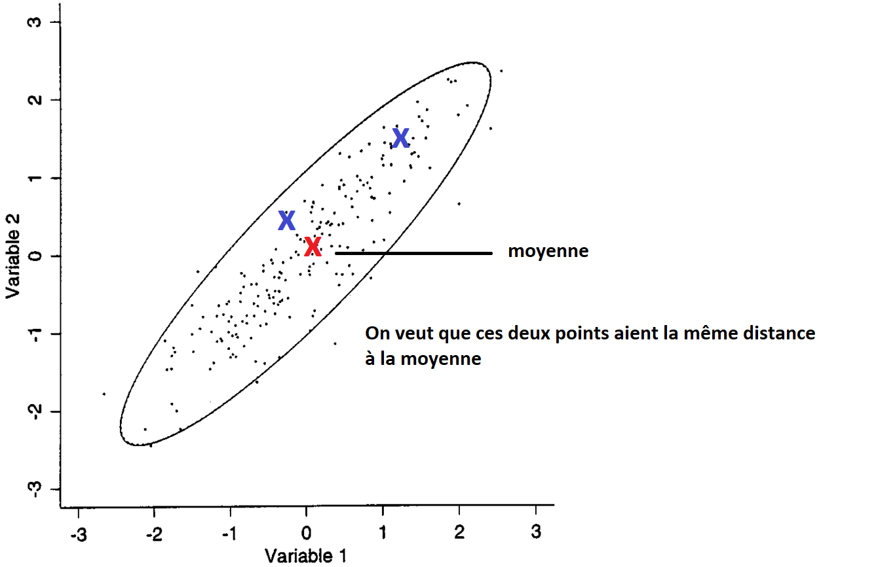
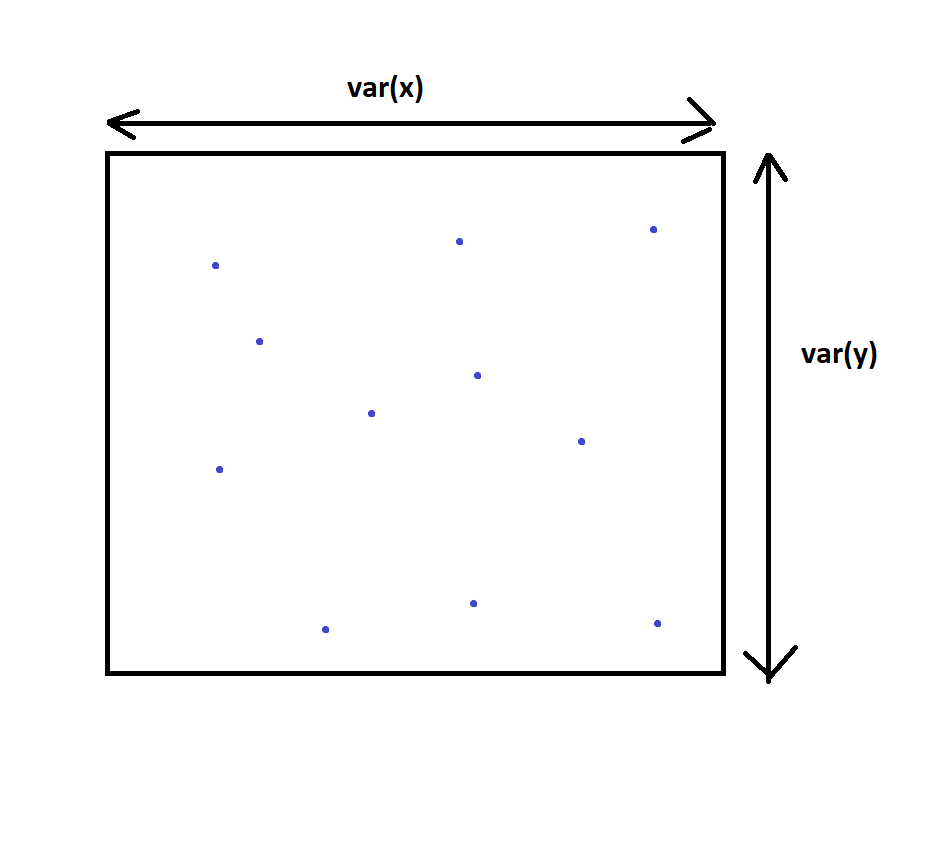
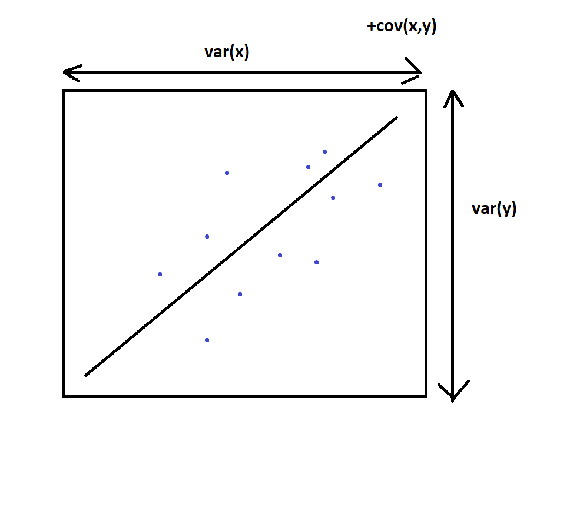
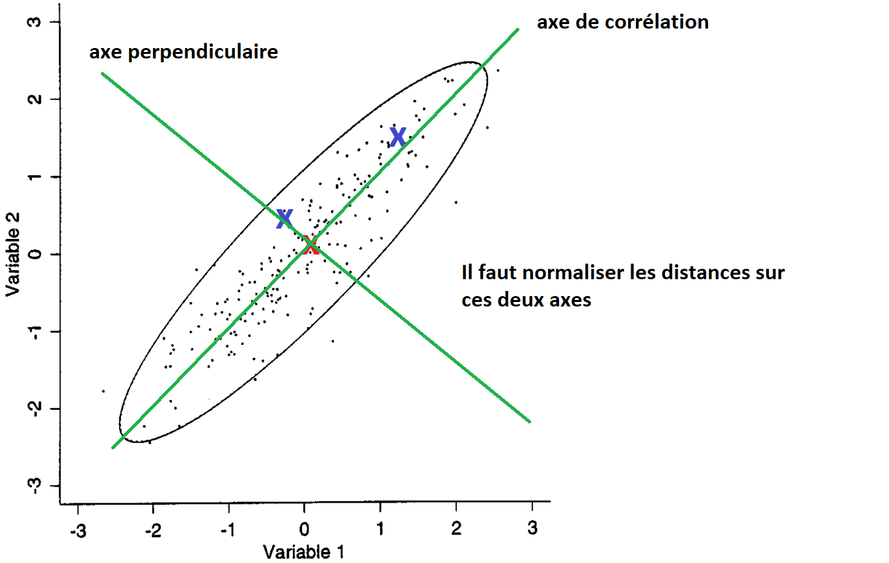
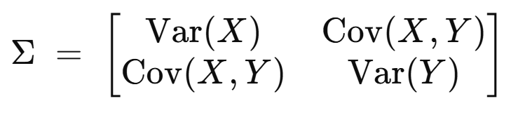
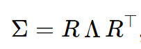
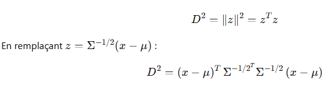

# Malahanobis distance

We want to find a norm that allows us to calculate the similarity between two vectors from a distribution.
The Euclidean norm is not suitable because it is invariant with respect to direction, so a vector that is modified equally
on a random coordinate with small or large variance will remain the same distance from the new vector, whereas the distance from 
the distribution is greater in the case of modification on the small variance.

# Solution :

Reminder: 

In a probability distribution, variance gives us the bounds within which the data lies,
while covariance tells us the direction that this data is taking. For example in 2d : 

  
  

To construct a Malahanobis distance starting from our Euclidean distance, we must normalize the distances on 
the correlation axis and the perpendicular axis proportionally to the variances of the random variables.

To do this, we use the 
root of the covariance matrix (we take the root because we normalize with standard deviations and not variance). 
The covariance matrix gives us the normalizations in the canonical basis on the diagonal, 
and the other covariance terms allow us to recalculate this normalization in the
directions of correlation. For example, in two dimensions:

To illustrate how this matrix works, we can see how it transforms a vector. Since it is
symmetric, we can diagonalize it with rotation matrices.

Lorsqu'on multiplie un vecteur par cette matrice,
il va donc être exprimé dans une nouvelle base créée par rotation de la première, puis être normalisé sur les 
axes de la nouvelle base avec les coefficients de diagonale, puis retourner en sens inverse pour revenir à la base
de départ. On normalise donc suivant les axes qu'on voulait : axe de corrélation et axe perpendiculaire.

En réalité dans le calcul, on utilise l'inverse de la racine de la  matrice de covariance car 
la matrice de covariance augmente les distances dans les directions où la variance est grande ce qui est l'inverse 
de ce que l'on veut. Au final,
ce que fait l'inverse de la racine de la  matrice de covariance c'est transformé l'ellipse de l'espace de départ en 
un cercle
dans l'espace d'arrivé, et la distance de malahanobis est la distance euclidienne calculée sur ce cercle.

When a vector is multiplied by this matrix,
it will be expressed in a new basis created by rotating the first one, then normalized on the 
axes of the new basis with the diagonal coefficients, then reversed to return to the original basis.
 We therefore normalize according to the desired axes: correlation axis and perpendicular axis.

In reality, in the calculation, we use the inverse of the root of the  covariance matrix because 
the covariance matrix increases the distances in the directions where the variance is large, which is the opposite 
of what we want. Ultimately,
what the inverse of the root of the  covariance matrix does is transforming the ellipse in the starting space into 
a circle
in the arrival space, and the Mahalanobis distance is the Euclidean distance calculated on this circle.

